# 系统架构文档

## 1. 架构概览 (Architecture Overview)

### 架构设计理念

MultiFormatConfigParser是一个多格式配置文件解析器组件库，其架构设计理念围绕着"统一接口、格式透明、高度可扩展"的核心思想。该系统通过精心设计的分层架构，实现了对不同配置格式的统一处理能力，使开发者能够以一致的方式操作多种格式的配置文件，而无需关心底层格式的具体实现细节。

架构设计遵循以下核心理念：

1. **抽象优先**：通过定义统一的配置操作接口，将具体实现与接口分离，实现了面向接口编程的设计原则。
2. **分层解耦**：采用清晰的分层架构，各层之间职责明确，降低了模块间的耦合度，提高了系统的可维护性。
3. **格式透明**：用户通过统一接口进行配置操作，无需关心文件的具体格式，实现了格式透明的配置管理。
4. **可扩展性**：通过工厂模式和适配器模式的结合，使得新增配置格式支持变得简单，系统具有良好的扩展性。
5. **第三方复用**：充分利用成熟的第三方解析库，避免重复造轮子，同时通过适配器模式统一其接口差异。

### 核心架构模式

系统采用了多种经典设计模式的组合，形成了一个灵活且可扩展的架构：

1. **工厂模式（Factory Pattern）**：
   - 通过ConfigParserFactory根据文件扩展名或类型标识动态创建相应的解析器实例
   - 实现了对象创建的封装，使客户端无需了解具体解析器的创建过程
   - 便于新增格式支持，只需扩展工厂方法而无需修改客户端代码

2. **适配器模式（Adapter Pattern）**：
   - 每个具体解析器都是对第三方解析库的适配，将其接口转换为统一的IConfigParser接口
   - 解决了不同第三方库接口不一致的问题，实现了接口统一化
   - 允许系统在不修改现有代码的情况下引入新的第三方库

3. **策略模式（Strategy Pattern）**：
   - 不同的解析器实现了相同的接口，但采用不同的解析策略
   - 运行时可根据文件类型动态选择合适的解析策略
   - 便于算法的独立变化和扩展

4. **分层架构模式（Layered Architecture）**：
   - 系统分为接口层、适配器层和基础设施层三个层次
   - 每层只与相邻层交互，实现了清晰的职责分离
   - 上层依赖下层抽象，符合依赖倒置原则

### 技术栈概述

MultiFormatConfigParser的技术栈以现代C++为核心，结合多个成熟的第三方解析库，构建了一个高效、可靠的配置文件处理系统：

1. **核心语言与技术**：
   - **C++11/14/17**：利用现代C++特性，如智能指针、lambda表达式、移动语义等
   - **标准库**：充分利用STL容器、算法和智能指针等标准组件
   - **异常处理**：采用C++标准异常机制，提供错误信息的捕获和传播

2. **第三方解析库**：
   - **yaml-cpp**：完整的YAML 1.2规范实现，支持复杂的YAML特性
   - **nlohmann_json**：现代化的JSON处理库，提供直观的API和出色的性能
   - **tinyxml2**：轻量级XML解析器，简单易用且性能优秀
   - **toml++**：现代C++ TOML解析库，支持最新的TOML规范
   - **inih**：简单的INI文件解析库，轻量级且高效

3. **设计模式与架构风格**：
   - **面向对象设计**：基于类和对象的模块化设计
   - **接口抽象**：通过抽象接口定义契约，实现多态
   - **RAII（资源获取即初始化）**：利用智能指针管理资源生命周期
   - **异常安全**：确保在异常情况下系统状态的完整性

4. **开发与构建工具**：
   - **CMake**：跨平台的构建系统，管理项目依赖和构建流程
   - **单元测试框架**：支持自动化测试，确保代码质量
   - **静态代码分析**：通过静态分析工具提升代码质量

## 2. 系统上下文 (System Context)

### 系统定位与价值

MultiFormatConfigParser定位为一个高复用性的组件库，旨在解决应用程序中配置文件管理的多样性和复杂性问题。在软件开发中，配置文件是连接应用程序与运行环境的桥梁，不同项目和场景可能采用不同的配置格式，这给配置管理带来了挑战。

系统的核心价值体现在以下几个方面：

1. **统一化配置管理**：
   - 提供统一的API接口，屏蔽不同配置格式之间的技术差异
   - 使开发者能够以一致的方式处理多种格式的配置文件
   - 降低学习成本，提高开发效率

2. **格式透明性**：
   - 用户无需关心配置文件的具体格式，系统自动识别并选择合适的解析器
   - 支持运行时格式切换，增强了系统的灵活性
   - 便于配置格式的迁移和转换

3. **高可复用性**：
   -作为独立的组件库，可轻松集成到各种C++应用程序中
   - 减少重复开发，降低项目的总体成本
   - 通过统一的接口设计，提高了代码的可维护性

4. **扩展性支持**：
   - 架构设计支持新配置格式的无缝扩展
   - 通过插件式的解析器设计，便于功能增强
   - 满足不断变化的业务需求和技术发展

5. **技术成熟度**：
   - 基于成熟的第三方解析库，保证了解析的准确性和稳定性
   - 经过充分测试，具有高可靠性
   - 符合行业标准和技术规范

### 用户角色与场景

MultiFormatConfigParser主要服务于以下两类用户角色，并满足他们在不同场景下的需求：

#### 1. 应用程序开发者

**角色描述**：负责实现应用程序功能，需要在项目中集成配置文件管理能力的C++开发者。

**核心需求**：
- 需要统一的配置文件处理接口，简化配置操作
- 希望支持多种配置格式，以适应不同项目需求
- 关注开发效率和代码复用，避免重复造轮子
- 需要稳定可靠的解析组件，确保应用程序的稳定性

**使用场景**：
- **新项目开发**：在启动新项目时，集成该组件库作为配置管理的基础设施
- **项目重构**：在现有项目重构过程中，统一配置文件处理逻辑
- **格式迁移**：当项目需要从一种配置格式迁移到另一种格式时，利用该组件简化迁移过程
- **多格式支持**：当应用程序需要支持多种配置格式时，通过该组件实现统一管理

#### 2. 系统架构师

**角色描述**：负责设计应用程序的整体架构，包括配置管理架构的技术决策者。

**核心需求**：
- 需要可扩展的配置管理解决方案，适应未来的技术变化
- 寻求标准化的配置处理接口，确保架构的一致性
- 关注与现有系统的兼容性和集成性
- 需要长期维护的技术栈，确保系统的可持续发展

**使用场景**：
- **架构设计**：在设计系统架构时，将该组件作为配置管理层的标准组件
- **技术选型**：在技术选型阶段，评估该组件是否满足系统的配置管理需求
- **标准制定**：在组织内部，将该组件作为配置管理的标准解决方案
- **性能评估**：评估该组件在高负载和大规模配置场景下的性能表现

### 外部系统交互

MultiFormatConfigParser作为中间层组件，与多个外部系统进行交互，形成一个完整的配置管理生态系统：

#### 1. 第三方解析库交互

系统依赖五个成熟的第三方解析库，每个库负责特定格式的配置文件解析：

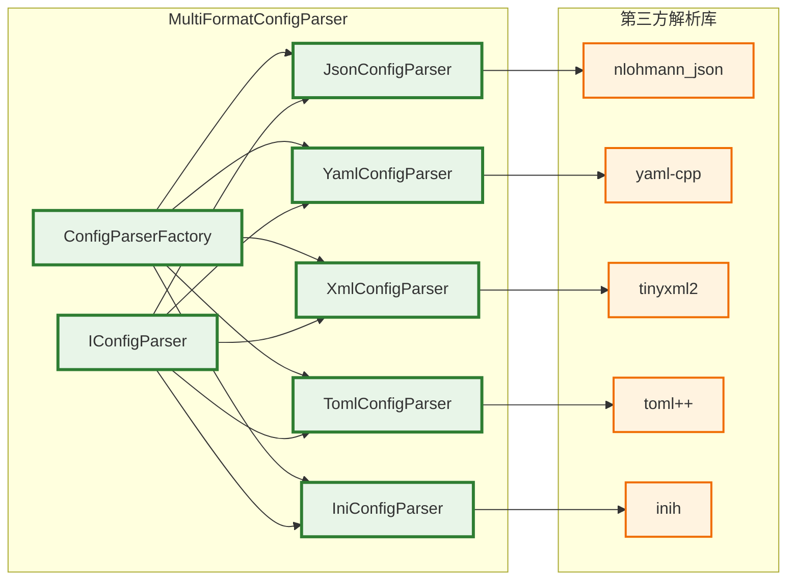
```mermaid
graph LR
    subgraph "MultiFormatConfigParser"
        A[ConfigParserFactory]
        B[IConfigParser]
        C[JsonConfigParser]
        D[YamlConfigParser]
        E[XmlConfigParser]
        F[TomlConfigParser]
        G[IniConfigParser]
    end
    
    subgraph "第三方解析库"
        H[nlohmann_json]
        I[yaml-cpp]
        J[tinyxml2]
        K[toml++]
        L[inih]
    end
    
    A --> C
    A --> D
    A --> E
    A --> F
    A --> G
    B --> C
    B --> D
    B --> E
    B --> F
    B --> G
    C --> H
    D --> I
    E --> J
    F --> K
    G --> L
    
    classDef mainSystem fill:#e8f5e8,stroke:#2e7d32,stroke-width:3px
    classDef externalLib fill:#fff3e0,stroke:#ef6c00,stroke-width:2px
    
    class A,B,C,D,E,F,G mainSystem
    class H,I,J,K,L externalLib
```

**交互特性分析**：

| 第三方库 | 功能描述 | 交互类型 | 重要性 | 稳定性 | 集成复杂度 |
|---------|---------|---------|--------|--------|-----------|
| nlohmann_json | 现代化JSON处理库，提供高性能的JSON解析和生成 | 依赖调用 | 高 | 高 | 低 |
| yaml-cpp | 完整的YAML 1.2规范实现，支持复杂YAML特性 | 依赖调用 | 高 | 高 | 中 |
| tinyxml2 | 轻量级XML解析器，简单易用，性能优秀 | 依赖调用 | 中 | 高 | 低 |
| toml++ | 现代C++ TOML解析库，支持最新TOML规范 | 依赖调用 | 中 | 中 | 低 |
| inih | 简单的INI文件解析库，轻量级且高效 | 依赖调用 | 低 | 高 | 低 |

#### 2. 应用程序集成交互

MultiFormatConfigParser作为组件库，被应用程序集成和使用，形成以下交互关系：

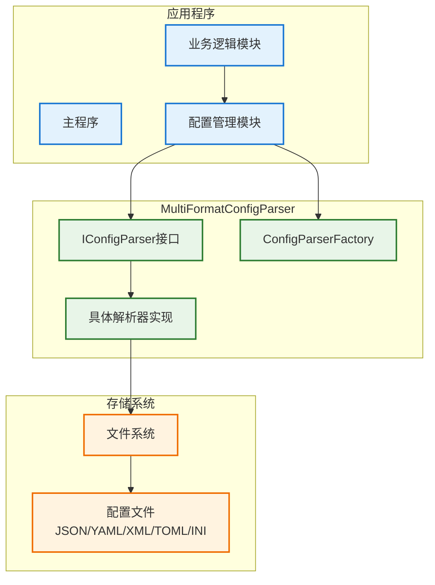
```mermaid
graph TB
    subgraph "应用程序"
        A[主程序]
        B[配置管理模块]
        C[业务逻辑模块]
    end
    
    subgraph "MultiFormatConfigParser"
        D[IConfigParser接口]
        E[ConfigParserFactory]
        F[具体解析器实现]
    end
    
    subgraph "存储系统"
        G[文件系统]
        H[配置文件<br/>JSON/YAML/XML/TOML/INI]
    end
    
    B --> E
    B --> D
    D --> F
    F --> G
    G --> H
    C --> B
    
    classDef app fill:#e3f2fd,stroke:#1976d2,stroke-width:2px
    classDef config fill:#e8f5e8,stroke:#2e7d32,stroke-width:2px
    classDef storage fill:#fff3e0,stroke:#ef6c00,stroke-width:2px
    
    class A,B,C app
    class D,E,F config
    class G,H storage
```

**交互流程**：
1. 应用程序通过ConfigParserFactory创建特定格式的解析器实例
2. 应用程序通过IConfigParser接口调用配置操作方法
3. 具体解析器实现调用对应的第三方库进行文件解析
4. 解析结果通过统一接口返回给应用程序
5. 应用程序可以使用返回的配置数据进行业务逻辑处理

### 系统边界定义

MultiFormatConfigParser的系统边界清晰地定义了组件的责任范围和与外部系统的交互接口，确保了架构的清晰性和可维护性。

#### 包含组件

系统边界内包含以下核心组件：

1. **配置解析器工厂（ConfigParserFactory）**：
   - 负责根据文件类型创建对应的解析器实例
   - 实现格式识别和解析器选择逻辑
   - 管理解析器的生命周期

2. **统一配置解析接口（IConfigParser）**：
   - 定义配置操作的标准接口契约
   - 包含load、get、set、save等核心方法
   - 为所有解析器提供统一的抽象

3. **各格式的具体解析器实现**：
   - JsonConfigParser：JSON格式配置解析器
   - YamlConfigParser：YAML格式配置解析器
   - XmlConfigParser：XML格式配置解析器
   - TomlConfigParser：TOML格式配置解析器
   - IniConfigParser：INI格式配置解析器

4. **配置文件操作的核心业务逻辑**：
   - 配置文件的加载、解析、修改和保存逻辑
   - 配置项的查询和更新机制
   - 格式转换和适配逻辑

5. **异常处理和错误管理机制**：
   - 统一的异常定义和处理框架
   - 错误信息的封装和传播
   - 异常安全的操作保证

#### 排除组件

系统边界外排除以下组件，它们被视为外部依赖或辅助工具：

1. **第三方解析库的具体实现细节**：
   - yaml-cpp、nlohmann_json等库的内部实现
   - 第三方库的特定API和扩展功能
   - 第三方库的版本管理和更新策略

2. **构建系统和编译配置文件**：
   - CMakeLists.txt等构建脚本
   - 编译选项和配置
   - 依赖管理和包管理配置

3. **文档生成工具**：
   - API文档生成器
   - 架构图生成工具
   - 文档模板和样式

4. **测试框架和示例代码**：
   - 单元测试和集成测试代码
   - 使用示例和演示程序
   - 性能测试和基准测试

#### 系统边界图

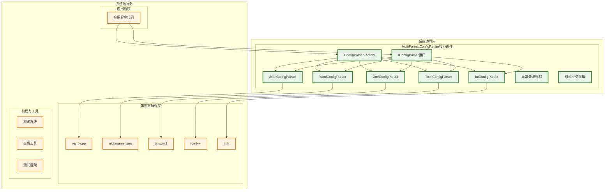
```mermaid
graph TB
    subgraph "系统边界内"
        subgraph "MultiFormatConfigParser核心组件"
            A[ConfigParserFactory]
            B[IConfigParser接口]
            C[JsonConfigParser]
            D[YamlConfigParser]
            E[XmlConfigParser]
            F[TomlConfigParser]
            G[IniConfigParser]
            H[异常处理机制]
            I[核心业务逻辑]
        end
    end
    
    subgraph "系统边界外"
        subgraph "第三方解析库"
            J[yaml-cpp]
            K[nlohmann_json]
            L[tinyxml2]
            M[toml++]
            N[inih]
        end
        
        subgraph "构建与工具"
            O[构建系统]
            P[文档工具]
            Q[测试框架]
        end
        
        subgraph "应用程序"
            R[应用程序代码]
        end
    end
    
    C --> J
    D --> K
    E --> L
    F --> M
    G --> N
    R --> A
    R --> B
    A --> C
    A --> D
    A --> E
    A --> F
    A --> G
    B --> C
    B --> D
    B --> E
    B --> F
    B --> G
    
    classDef inside fill:#e8f5e8,stroke:#2e7d32,stroke-width:3px
    classDef outside fill:#fff3e0,stroke:#ef6c00,stroke-width:2px
    classDef boundary fill:none,stroke:#333,stroke-width:2px,stroke-dasharray: 5 5
    
    class A,B,C,D,E,F,G,H,I inside
    class J,K,L,M,N,O,P,Q,R outside
```

**边界交互接口**：

1. **应用程序接口**：
   - ConfigParserFactory::createParser()
   - IConfigParser::load()
   - IConfigParser::get()
   - IConfigParser::set()
   - IConfigParser::save()

2. **第三方库接口**：
   - YAML::LoadFile() / YAML::Emitter
   - nlohmann::json::parse() / dump()
   - tinyxml2::XMLDocument::LoadFile() / SaveFile()
   - toml::parse() / toml::table
   - ini_parse() / ini_writer

通过明确的系统边界定义，MultiFormatConfigParser实现了清晰的职责分离，确保了组件的可维护性和可扩展性，同时为外部系统提供了稳定可靠的接口。

## 3. 容器视图 (Container View)

### 领域模块划分

基于对系统的深入分析，MultiFormatConfigParser被划分为四个核心领域模块，每个模块承担特定的职责，共同构成完整的配置文件处理生态系统。这种划分基于业务功能、技术特性和职责内聚性原则，确保了架构的清晰性和可维护性。

#### 1. 配置文件解析域（核心业务域）

**模块描述**：配置文件解析域是系统的核心业务域，负责管理各种格式配置文件的完整生命周期，包括加载、解析、修改和保存操作。该领域提供了统一的配置管理能力，屏蔽不同格式间的技术差异，为上层应用提供标准化的配置访问接口。

**重要性**：10.0/10.0（最高重要性）
**复杂度**：8.0/10.0
**核心职责**：
- 提供统一的配置文件操作接口
- 管理配置文件的生命周期
- 实现不同格式间的适配和转换
- 处理配置项的查询和更新操作

**子模块**：
- **YAML配置解析器**：基于yaml-cpp库实现YAML格式配置文件的处理
- **XML配置解析器**：基于tinyxml2库实现XML格式配置文件的处理
- **TOML配置解析器**：基于toml++库实现TOML格式配置文件的处理
- **INI配置解析器**：基于inih库实现INI格式配置文件的处理

#### 2. YAML处理基础设施域（基础设施域）

**模块描述**：YAML处理基础设施域提供了完整的YAML语言解析和生成能力，包括词法分析、语法解析、AST构建和文档生成等核心功能。该领域是YAML配置解析的技术支撑基础，确保YAML文档能够被准确解析和处理。

**重要性**：8.0/10.0
**复杂度**：9.0/10.0
**核心职责**：
- 实现YAML文档的词法分析
- 构建和维护语法解析树
- 管理YAML节点的内存表示
- 提供YAML文档的序列化能力

**子模块**：
- **YAML解析引擎**：负责将YAML文本转换为内存中的节点结构
- **YAML词法分析器**：负责将YAML文本分解为语法单元
- **YAML节点构建器**：负责构建和管理YAML文档的内存表示
- **YAML发射器**：负责将内存中的节点转换为YAML文本输出

#### 3. 数据处理工具域（工具支撑域）

**模块描述**：数据处理工具域提供了各种基础的数据处理和转换功能，包括类型转换、字符串处理、编码解码等通用工具，为上层业务逻辑提供技术支撑。该领域虽然不是直接面向业务的功能域，但为整个系统的稳定运行提供了必要的基础能力。

**重要性**：7.0/10.0
**复杂度**：7.0/10.0
**核心职责**：
- 提供数据类型间的转换功能
- 处理字符串的解析和格式化
- 实现二进制数据的编解码
- 支持数值类型的高精度处理

**子模块**：
- **类型转换工具**：提供各种数据类型之间的转换功能
- **字符串处理工具**：负责YAML标量值的解析和转义处理
- **编码解码工具**：负责二进制数据的Base64编解码
- **浮点数处理工具**：提供高精度的浮点数到字符串转换

#### 4. 系统支撑域（基础设施域）

**模块描述**：系统支撑域提供了项目运行所需的基础支撑能力，包括异常处理、内存管理、深度保护等底层功能，确保系统的稳定性和可靠性。该领域虽然不直接参与业务逻辑处理，但为整个系统的正常运行提供了必要的保障。

**重要性**：6.0/10.0
**复杂度**：6.0/10.0
**核心职责**：
- 提供统一的异常处理机制
- 管理系统资源的分配和释放
- 防止递归过深导致的栈溢出
- 处理YAML文档的版本和标签指令

**子模块**：
- **异常处理组件**：提供统一的异常定义和管理机制
- **内存管理组件**：提供高效的内存分配和管理功能
- **深度保护组件**：防止递归过深导致的栈溢出问题
- **指令处理组件**：管理YAML文档的版本和标签指令

### 领域模块架构

领域模块架构展示了各个领域模块之间的关系和交互方式，形成一个有机的整体系统。通过清晰的模块划分和明确的职责边界，系统实现了高内聚、低耦合的设计目标。

#### 领域模块关系图

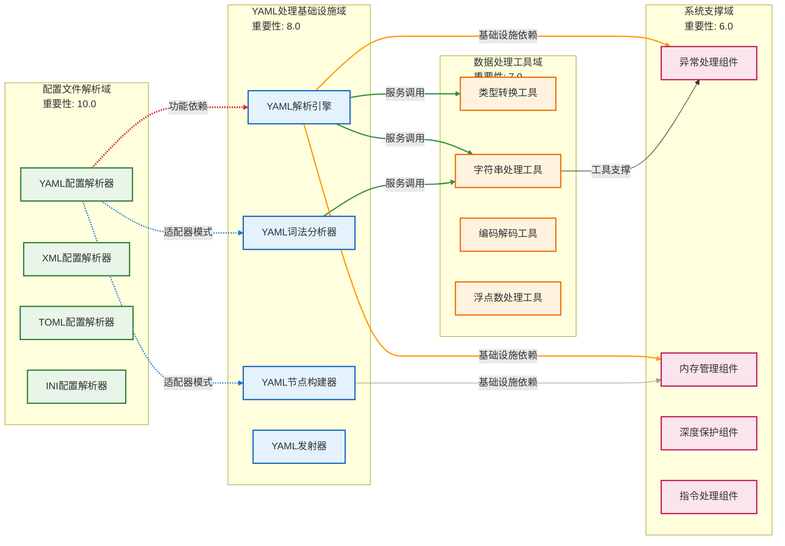
```mermaid
graph LR
    %% 领域模块定义
    subgraph "配置文件解析域<br/>重要性: 10.0"
        A1[YAML配置解析器]
        A2[XML配置解析器]
        A3[TOML配置解析器]
        A4[INI配置解析器]
    end
    
    subgraph "YAML处理基础设施域<br/>重要性: 8.0"
        B1[YAML解析引擎]
        B2[YAML词法分析器]
        B3[YAML节点构建器]
        B4[YAML发射器]
    end
    
    subgraph "数据处理工具域<br/>重要性: 7.0"
        C1[类型转换工具]
        C2[字符串处理工具]
        C3[编码解码工具]
        C4[浮点数处理工具]
    end
    
    subgraph "系统支撑域<br/>重要性: 6.0"
        D1[异常处理组件]
        D2[内存管理组件]
        D3[深度保护组件]
        D4[指令处理组件]
    end
    
    %% 模块间关系
    A1 -.->|功能依赖| B1
    A1 -.->|适配器模式| B2
    A1 -.->|适配器模式| B3
    
    B1 -->|服务调用| C1
    B1 -->|服务调用| C2
    B2 -->|服务调用| C2
    
    B1 -->|基础设施依赖| D1
    B1 -->|基础设施依赖| D2
    B3 -->|基础设施依赖| D2
    
    C2 -->|工具支撑| D1
    
    %% 关系强度标注
    linkStyle 0 stroke-width:3px,stroke:#d32f2f
    linkStyle 1 stroke-width:2px,stroke:#1976d2
    linkStyle 2 stroke-width:2px,stroke:#1976d2
    linkStyle 3 stroke-width:2px,stroke:#388e3c
    linkStyle 4 stroke-width:2px,stroke:#388e3c
    linkStyle 5 stroke-width:2px,stroke:#388e3c
    linkStyle 6 stroke-width:2px,stroke:#ff9800
    linkStyle 7 stroke-width:2px,stroke:#ff9800
    linkStyle 8 stroke-width:1px,stroke:#9e9e9e
    
    %% 样式定义
    classDef coreDomain fill:#e8f5e8,stroke:#2e7d32,stroke-width:2px
    classDef infraDomain fill:#e3f2fd,stroke:#1565c0,stroke-width:2px
    classDef toolDomain fill:#fff3e0,stroke:#ef6c00,stroke-width:2px
    classDef supportDomain fill:#fce4ec,stroke:#c2185b,stroke-width:2px
    
    class A1,A2,A3,A4 coreDomain
    class B1,B2,B3,B4 infraDomain
    class C1,C2,C3,C4 toolDomain
    class D1,D2,D3,D4 supportDomain
```

#### 领域模块依赖关系分析

1. **配置文件解析域 → YAML处理基础设施域**：
   - **关系类型**：功能依赖
   - **依赖强度**：10.0/10.0（最强依赖）
   - **依赖描述**：配置文件解析域依赖YAML处理基础设施域提供的YAML解析能力，通过调用yaml-cpp库的核心功能实现YAML配置文件的加载、解析和保存。这是系统中最关键的依赖关系，直接影响YAML配置处理的核心功能。

2. **配置文件解析域 → YAML处理基础设施域**：
   - **关系类型**：适配器模式
   - **依赖强度**：9.0/10.0
   - **依赖描述**：配置文件解析域通过统一的接口模式使用各个第三方库提供的特定格式解析能力，实现多格式支持的统一抽象。这种关系体现了系统的设计模式应用，是实现格式透明处理的关键。

3. **YAML处理基础设施域 → 数据处理工具域**：
   - **关系类型**：服务调用
   - **依赖强度**：8.0/10.0
   - **依赖描述**：YAML处理基础设施域依赖数据处理工具域提供的字符串处理、类型转换等基础功能，支撑YAML文档的准确解析和处理。这种依赖确保了YAML解析过程中的数据转换和处理能力。

4. **YAML处理基础设施域 → 系统支撑域**：
   - **关系类型**：基础设施依赖
   - **依赖强度**：7.0/10.0
   - **依赖描述**：YAML处理基础设施域依赖系统支撑域提供的异常处理、内存管理等基础能力，确保YAML处理过程的稳定性和安全性。这种依赖为系统提供了必要的运行时保障。

5. **数据处理工具域 → 系统支撑域**：
   - **关系类型**：工具支撑
   - **依赖强度**：5.0/10.0
   - **依赖描述**：数据处理工具域为系统支撑域提供基础的字符串处理和数据转换能力，支持异常信息和日志的格式化输出。这种依赖相对较弱，但对系统的完整性有一定贡献。

### 存储设计

MultiFormatConfigParser的存储设计主要关注配置文件的组织结构、内存表示和持久化策略。系统采用分层存储架构，实现了配置数据在不同存储介质间的有效转换和管理。

#### 配置文件存储结构

系统支持多种格式的配置文件，每种格式都有其特定的存储结构和表示方式：

1. **YAML格式存储**：
   - **结构特点**：基于缩进的层次结构，支持复杂数据类型如列表、映射等
   - **数据表示**：使用键值对和层次结构组织配置项
   - **示例结构**：
     ```yaml
     database:
       host: localhost
       port: 5432
       name: myapp
       credentials:
         username: admin
         password: secret123
     ```

2. **JSON格式存储**：
   - **结构特点**：基于大括号和方括号的嵌套结构，严格的数据类型定义
   - **数据表示**：使用对象和数组组织配置数据
   - **示例结构**：
     ```json
     {
       "database": {
         "host": "localhost",
         "port": 5432,
         "name": "myapp",
         "credentials": {
           "username": "admin",
           "password": "secret123"
         }
       }
     }
     ```

3. **XML格式存储**：
   - **结构特点**：基于标签的树形结构，支持属性和命名空间
   - **数据表示**：使用元素和属性组织配置数据
   - **示例结构**：
     ```xml
     <configuration>
       <database>
         <host>localhost</host>
         <port>5432</port>
         <name>myapp</name>
         <credentials>
           <username>admin</username>
           <password>secret123</password>
         </credentials>
       </database>
     </configuration>
     ```

4. **TOML格式存储**：
   - **结构特点**：基于节点的扁平结构，支持数组和嵌套表
   - **数据表示**：使用键值对和表组织配置数据
   - **示例结构**：
     ```toml
     [database]
     host = "localhost"
     port = 5432
     name = "myapp"
     
     [database.credentials]
     username = "admin"
     password = "secret123"
     ```

5. **INI格式存储**：
   - **结构特点**：基于节的简单结构，支持基本的键值对
   - **数据表示**：使用节和键值对组织配置数据
   - **示例结构**：
     ```ini
     [database]
     host=localhost
     port=5432
     name=myapp
     
     [credentials]
     username=admin
     password=secret123
     ```

#### 内存表示设计

系统在内存中使用统一的数据结构表示配置数据，实现了不同格式间的透明访问：

```mermaid
classDiagram
    class ConfigNode {
        +string key
        +string value
        +ConfigNodeType type
        +map~string, ConfigNode~ children
        +vector~ConfigNode~ array
        +getValue() T
        +setValue(T value)
        +addChild(key, node)
        +getChild(key) ConfigNode*
        +hasChild(key) bool
    }
    
    enum ConfigNodeType {
        SCALAR
        MAP
        ARRAY
    }
    
    class ConfigDocument {
        +ConfigNode* root
        +string filePath
        +ConfigFormat format
        +load(filePath) bool
        +save(filePath) bool
        +getRoot() ConfigNode*
        +findNode(path) ConfigNode*
    }
    
    enum ConfigFormat {
        YAML
        JSON
        XML
        TOML
        INI
    }
    
    ConfigDocument "1" *-- "1" ConfigNode
    ConfigNode "1" *-- "0..*" ConfigNode
    ConfigNode --> ConfigNodeType
    ConfigDocument --> ConfigFormat
```

**内存结构特点**：
1. **树形结构**：配置数据在内存中呈现为树形结构，根节点代表整个配置文档
2. **节点类型**：支持标量(SCALAR)、映射(MAP)和数组(ARRAY)三种节点类型
3. **类型安全**：使用模板方法实现类型安全的值访问
4. **路径查找**：支持通过路径字符串快速定位嵌套配置项
5. **格式标识**：每个配置文档都标识其原始格式，便于序列化时保持格式一致性

#### 持久化策略

系统实现了灵活的配置文件持久化策略，确保配置数据能够正确地保存到文件系统：

1. **原子写入**：
   - 采用"写入临时文件+重命名"的策略确保写入的原子性
   - 防止写入过程中的异常导致配置文件损坏
   - 保证配置文件的完整性和一致性

2. **格式保持**：
   - 保存时保持原始文件的格式特性
   - 维持注释、缩进和格式风格（在支持的情况下）
   - 确保保存后的文件可读性和版本兼容性

3. **备份机制**：
   - 可选的配置文件自动备份功能
   - 支持备份版本管理和恢复
   - 提供配置变更历史追踪能力

4. **权限管理**：
   - 保持原始文件的权限设置
   - 支持文件权限的显式配置
   - 确保配置文件的安全性

### 领域模块间通信

领域模块间的通信机制是系统架构的关键组成部分，它决定了模块间的交互方式和信息流动路径。MultiFormatConfigParser采用了多种通信模式，确保了模块间的有效协作和数据的正确传递。

#### 通信模式设计

1. **接口调用模式**：
   - **描述**：通过定义良好的抽象接口进行模块间通信
   - **实现方式**：IConfigParser接口作为统一的通信契约
   - **适用场景**：配置文件解析域与具体解析器实现之间的通信
   - **优势**：松耦合、易扩展、可测试性强

2. **事件驱动模式**：
   - **描述**：通过事件发布和订阅机制进行异步通信
   - **实现方式**：YAML解析过程中的事件流处理
   - **适用场景**：YAML处理基础设施域内部组件间的通信
   - **优势**：降低模块间直接依赖、提高并发处理能力

3. **直接调用模式**：
   - **描述**：模块间的直接方法调用
   - **实现方式**：函数调用和方法引用
   - **适用场景**：系统支撑域与数据处理工具域之间的通信
   - **优势**：简单直接、性能高、实现成本低

4. **数据共享模式**：
   - **描述**：通过共享数据结构进行信息交换
   - **实现方式**：共享内存中的配置节点树
   - **适用场景**：配置文件解析域与YAML处理基础设施域之间的数据交换
   - **优势**：减少数据复制、提高访问效率、简化数据同步

#### 通信接口定义

系统定义了清晰的通信接口，规范了模块间的交互契约：

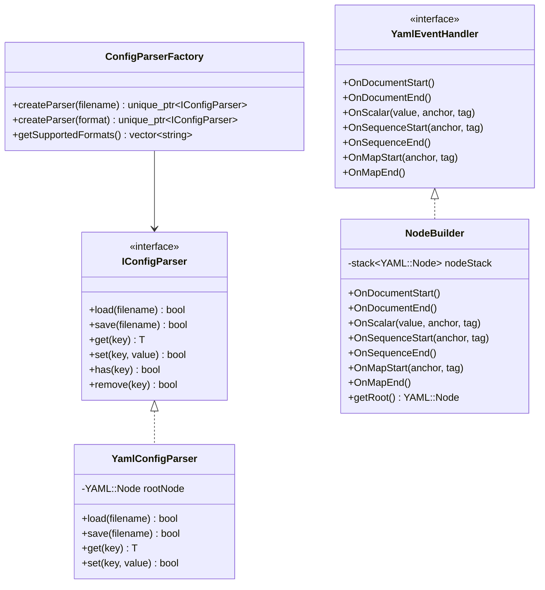
```mermaid
classDiagram
    class IConfigParser {
        <<interface>>
        +load(filename) bool
        +save(filename) bool
        +get(key) T
        +set(key, value) bool
        +has(key) bool
        +remove(key) bool
    }
    
    class ConfigParserFactory {
        +createParser(filename) unique_ptr~IConfigParser~
        +createParser(format) unique_ptr~IConfigParser~
        +getSupportedFormats() vector~string~
    }
    
    class YamlConfigParser {
        -YAML::Node rootNode
        +load(filename) bool
        +save(filename) bool
        +get(key) T
        +set(key, value) bool
    }
    
    class YamlEventHandler {
        <<interface>>
        +OnDocumentStart()
        +OnDocumentEnd()
        +OnScalar(value, anchor, tag)
        +OnSequenceStart(anchor, tag)
        +OnSequenceEnd()
        +OnMapStart(anchor, tag)
        +OnMapEnd()
    }
    
    class NodeBuilder {
        -stack~YAML::Node~ nodeStack
        +OnDocumentStart()
        +OnDocumentEnd()
        +OnScalar(value, anchor, tag)
        +OnSequenceStart(anchor, tag)
        +OnSequenceEnd()
        +OnMapStart(anchor, tag)
        +OnMapEnd()
        +getRoot() YAML::Node
    }
    
    IConfigParser <|.. YamlConfigParser
    ConfigParserFactory --> IConfigParser
    YamlEventHandler <|.. NodeBuilder
```

#### 关键通信流程

1. **配置加载通信流程**：

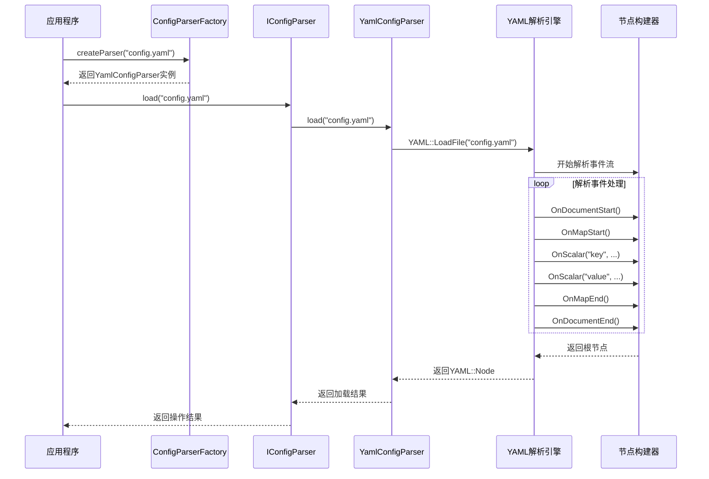
```mermaid
sequenceDiagram
    participant App as 应用程序
    participant Factory as ConfigParserFactory
    participant Interface as IConfigParser
    participant YamlParser as YamlConfigParser
    participant YamlEngine as YAML解析引擎
    participant NodeBuilder as 节点构建器
    
    App->>Factory: createParser("config.yaml")
    Factory-->>App: 返回YamlConfigParser实例
    
    App->>Interface: load("config.yaml")
    Interface->>YamlParser: load("config.yaml")
    
    YamlParser->>YamlEngine: YAML::LoadFile("config.yaml")
    YamlEngine->>NodeBuilder: 开始解析事件流
    
    loop 解析事件处理
        YamlEngine->>NodeBuilder: OnDocumentStart()
        YamlEngine->>NodeBuilder: OnMapStart()
        YamlEngine->>NodeBuilder: OnScalar("key", ...)
        YamlEngine->>NodeBuilder: OnScalar("value", ...)
        YamlEngine->>NodeBuilder: OnMapEnd()
        YamlEngine->>NodeBuilder: OnDocumentEnd()
    end
    
    NodeBuilder-->>YamlEngine: 返回根节点
    YamlEngine-->>YamlParser: 返回YAML::Node
    YamlParser-->>Interface: 返回加载结果
    Interface-->>App: 返回操作结果
```

2. **配置项访问通信流程**：

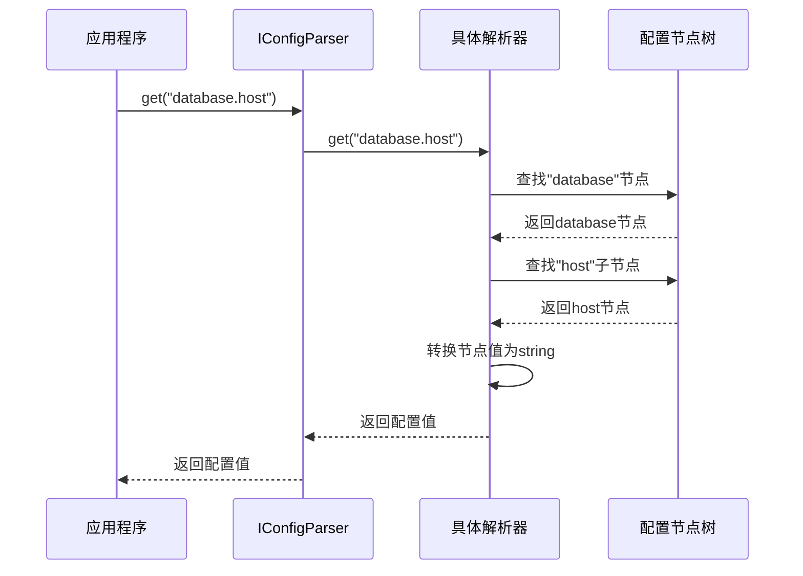
```mermaid
sequenceDiagram
    participant App as 应用程序
    participant Interface as IConfigParser
    participant Parser as 具体解析器
    participant NodeTree as 配置节点树
    
    App->>Interface: get("database.host")
    Interface->>Parser: get("database.host")
    
    Parser->>NodeTree: 查找"database"节点
    NodeTree-->>Parser: 返回database节点
    
    Parser->>NodeTree: 查找"host"子节点
    NodeTree-->>Parser: 返回host节点
    
    Parser->>Parser: 转换节点值为string
    Parser-->>Interface: 返回配置值
    Interface-->>App: 返回配置值
```

#### 异常处理通信

系统实现了统一的异常处理通信机制，确保错误信息能够在模块间正确传递和处理：

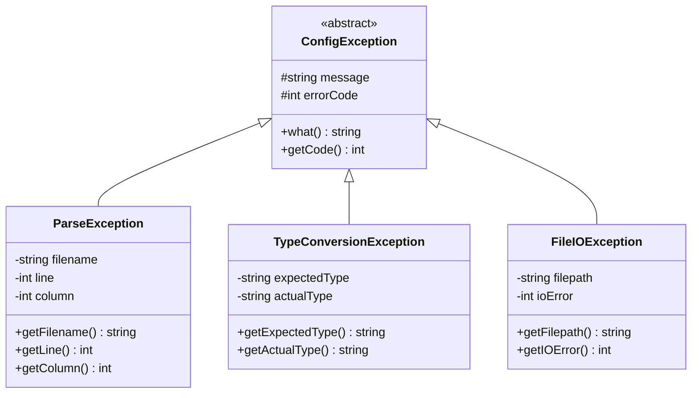
```mermaid
classDiagram
    class ConfigException {
        <<abstract>>
        #string message
        #int errorCode
        +what() string
        +getCode() int
    }
    
    class ParseException {
        -string filename
        -int line
        -int column
        +getFilename() string
        +getLine() int
        +getColumn() int
    }
    
    class TypeConversionException {
        -string expectedType
        -string actualType
        +getExpectedType() string
        +getActualType() string
    }
    
    class FileIOException {
        -string filepath
        -int ioError
        +getFilepath() string
        +getIOError() int
    }
    
    ConfigException <|-- ParseException
    ConfigException <|-- TypeConversionException
    ConfigException <|-- FileIOException
```

**异常处理策略**：
1. **异常捕获**：在模块边界捕获特定类型的异常
2. **异常转换**：将底层异常转换为应用层可理解的异常类型
3. **异常传播**：通过调用链向上传播异常信息
4. **异常恢复**：在适当的位置实现异常恢复机制
5. **异常记录**：记录异常信息用于调试和分析

通过精心设计的领域模块间通信机制，MultiFormatConfigParser实现了模块间的松耦合协作，确保了系统的可维护性、可扩展性和可靠性。

## 4. 组件视图 (Component View)

### 核心功能组件

MultiFormatConfigParser的核心功能组件构成了系统的骨架，它们共同实现了多格式配置文件的统一处理能力。这些组件基于设计模式的最佳实践，实现了高内聚、低耦合的架构设计。

#### 1. 配置解析器工厂（ConfigParserFactory）

**组件描述**：ConfigParserFactory是系统的核心创建型组件，负责根据配置文件类型动态创建对应的解析器实例。它实现了工厂模式，封装了对象创建的逻辑，使客户端无需了解具体解析器的创建过程。

**核心职责**：
- 根据文件扩展名或格式标识识别配置文件类型
- 创建并初始化对应格式的解析器实例
- 管理解析器的生命周期和资源分配
- 提供系统支持的格式列表查询功能

**关键接口设计**：

```cpp
class ConfigParserFactory {
public:
    // 根据文件路径创建解析器
    static std::unique_ptr<IConfigParser> createParser(const std::string& filePath);
    
    // 根据格式类型创建解析器
    static std::unique_ptr<IConfigParser> createParser(ConfigFormat format);
    
    // 获取系统支持的所有配置格式
    static std::vector<std::string> getSupportedFormats();
    
    // 检查指定格式是否受支持
    static bool isFormatSupported(const std::string& format);
    
private:
    // 格式识别函数
    static ConfigFormat detectFormat(const std::string& filePath);
    
    // 解析器创建函数映射
    using ParserCreator = std::function<std::unique_ptr<IConfigParser>()>;
    static std::map<ConfigFormat, ParserCreator> parserCreators_;
};
```

**实现细节**：
- 使用静态工厂方法实现单例模式
- 采用函数映射表实现解析器类型的动态注册
- 基于文件扩展名的格式识别算法
- 智能指针管理解析器实例的生命周期

**时序图**：

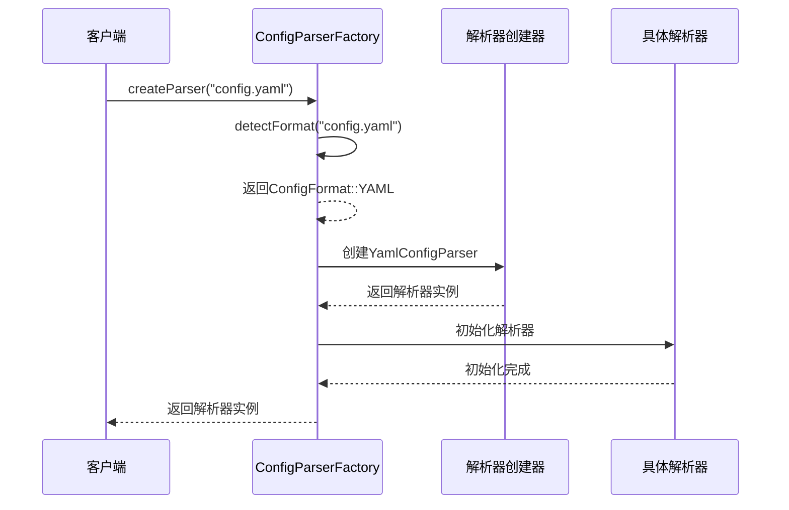
```mermaid
sequenceDiagram
    participant Client as 客户端
    participant Factory as ConfigParserFactory
    participant Creator as 解析器创建器
    participant Parser as 具体解析器
    
    Client->>Factory: createParser("config.yaml")
    Factory->>Factory: detectFormat("config.yaml")
    Factory-->>Factory: 返回ConfigFormat::YAML
    
    Factory->>Creator: 创建YamlConfigParser
    Creator-->>Factory: 返回解析器实例
    
    Factory->>Parser: 初始化解析器
    Parser-->>Factory: 初始化完成
    
    Factory-->>Client: 返回解析器实例
```

#### 2. 统一配置解析接口（IConfigParser）

**组件描述**：IConfigParser是系统的抽象接口组件，定义了所有配置解析器必须实现的标准操作契约。它体现了面向接口编程的设计原则，为不同格式的解析器提供了统一的抽象，实现了多态性。

**核心职责**：
- 定义配置操作的标准接口契约
- 提供配置文件加载、保存的抽象方法
- 提供配置项查询、更新的抽象方法
- 确保所有解析器实现的一致性

**关键接口设计**：

```cpp
class IConfigParser {
public:
    virtual ~IConfigParser() = default;
    
    // 配置文件加载
    virtual bool load(const std::string& filePath) = 0;
    
    // 配置文件保存
    virtual bool save(const std::string& filePath) = 0;
    
    // 配置项查询
    template<typename T>
    T get(const std::string& key, const T& defaultValue = T()) {
        try {
            return getValue<T>(key);
        } catch (const std::exception&) {
            return defaultValue;
        }
    }
    
    // 配置项设置
    template<typename T>
    bool set(const std::string& key, const T& value) {
        return setValue(key, value);
    }
    
    // 配置项存在性检查
    virtual bool has(const std::string& key) const = 0;
    
    // 配置项移除
    virtual bool remove(const std::string& key) = 0;
    
    // 获取所有配置项键
    virtual std::vector<std::string> getKeys() const = 0;
    
protected:
    // 类型安全的值获取（由派生类实现）
    template<typename T>
    virtual T getValue(const std::string& key) = 0;
    
    // 类型安全的值设置（由派生类实现）
    template<typename T>
    virtual bool setValue(const std::string& key, const T& value) = 0;
};
```

**设计特点**：
- 使用纯虚函数定义接口契约
- 采用模板方法实现类型安全的配置操作
- 提供默认值保护机制，增强接口的健壮性
- 支持嵌套配置项的路径访问（如"database.host"）

#### 3. YAML配置解析器（YamlConfigParser）

**组件描述**：YamlConfigParser是YAML格式配置文件的具体解析器实现，它封装了yaml-cpp库的功能，实现了IConfigParser接口。作为系统中最重要的解析器之一，它提供了完整的YAML配置文件处理能力。

**核心职责**：
- 实现YAML配置文件的加载和保存
- 提供YAML配置项的查询和更新功能
- 处理YAML特有的数据结构和类型
- 管理YAML文档的内存表示

**关键实现**：

```cpp
class YamlConfigParser : public IConfigParser {
public:
    YamlConfigParser() = default;
    explicit YamlConfigParser(const std::string& filePath);
    
    bool load(const std::string& filePath) override;
    bool save(const std::string& filePath) override;
    bool has(const std::string& key) const override;
    bool remove(const std::string& key) override;
    std::vector<std::string> getKeys() const override;

protected:
    template<typename T>
    T getValue(const std::string& key) override;
    
    template<typename T>
    bool setValue(const std::string& key, const T& value) override;

private:
    YAML::Node rootNode_;
    std::string currentFilePath_;
    
    // 辅助函数
    YAML::Node findNode(const std::string& key) const;
    std::vector<std::string> splitKey(const std::string& key) const;
    bool createNestedNodes(const std::vector<std::string>& keys);
};

// 模板特化实现
template<>
std::string YamlConfigParser::getValue<std::string>(const std::string& key);

template<>
int YamlConfigParser::getValue<int>(const std::string& key);

template<>
bool YamlConfigParser::getValue<bool>(const std::string& key);

template<>
std::vector<std::string> YamlConfigParser::getValue<std::vector<std::string>>(const std::string& key);
```

**实现细节**：
- 使用YAML::Node作为内部数据结构
- 实现嵌套配置项的路径解析算法
- 提供类型特化支持常见数据类型
- 处理YAML特有的数据类型如锚点、别名等

**数据流图**：

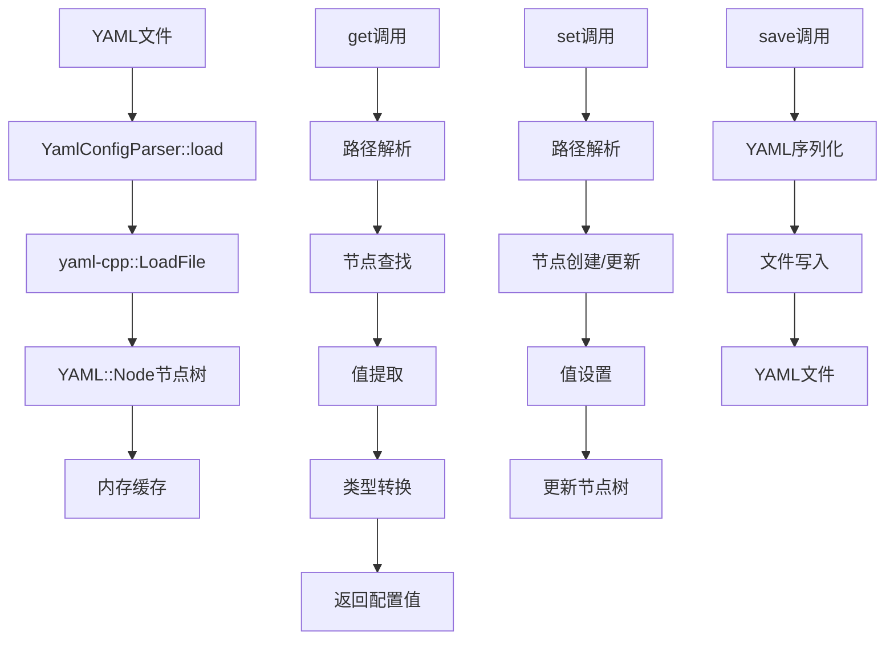
```mermaid
graph TD
    A[YAML文件] --> B[YamlConfigParser::load]
    B --> C[yaml-cpp::LoadFile]
    C --> D[YAML::Node节点树]
    D --> E[内存缓存]
    
    F[get调用] --> G[路径解析]
    G --> H[节点查找]
    H --> I[值提取]
    I --> J[类型转换]
    J --> K[返回配置值]
    
    L[set调用] --> M[路径解析]
    M --> N[节点创建/更新]
    N --> O[值设置]
    O --> P[更新节点树]
    
    Q[save调用] --> R[YAML序列化]
    R --> S[文件写入]
    S --> T[YAML文件]
```

#### 4. 其他格式解析器实现

系统还包含其他格式的解析器实现，它们都遵循相同的设计模式，实现了统一的IConfigParser接口：

**JSON配置解析器（JsonConfigParser）**：
- 基于nlohmann_json库实现
- 支持JSON格式的完整特性
- 提供高性能的JSON解析能力

**XML配置解析器（XmlConfigParser）**：
- 基于tinyxml2库实现
- 支持XML的层次结构和属性
- 处理XML命名空间和CDATA段

**TOML配置解析器（TomlConfigParser）**：
- 基于toml++库实现
- 支持TOML的表和数组结构
- 处理TOML的日期时间类型

**INI配置解析器（IniConfigParser）**：
- 基于inih库实现
- 支持INI格式的简单节和键值对
- 处理INI格式的注释和转义

### 技术支撑组件

技术支撑组件为系统的核心功能提供底层技术支持，它们虽然不直接面向业务功能，但确保了系统的稳定性、性能和可靠性。

#### 1. 异常处理框架（ExceptionFramework）

**组件描述**：异常处理框架为系统提供了统一的错误处理机制，确保在配置处理过程中出现的各种异常情况能够被正确捕获、处理和传播。

**核心职责**：
- 定义系统特定的异常类型
- 提供异常信息的封装和格式化
- 实现异常的安全传播机制
- 支持异常的捕获和恢复策略

**异常类型设计**：

```cpp
// 基础异常类
class ConfigException : public std::exception {
public:
    explicit ConfigException(const std::string& message, int errorCode = 0)
        : message_(message), errorCode_(errorCode) {}
    
    const char* what() const noexcept override {
        return message_.c_str();
    }
    
    int getErrorCode() const noexcept {
        return errorCode_;
    }

protected:
    std::string message_;
    int errorCode_;
};

// 解析异常
class ParseException : public ConfigException {
public:
    ParseException(const std::string& filename, int line, int column, 
                   const std::string& message)
        : ConfigException(message, ERROR_PARSE),
          filename_(filename), line_(line), column_(column) {
        formatMessage();
    }
    
    const std::string& getFilename() const { return filename_; }
    int getLine() const { return line_; }
    int getColumn() const { return column_; }

private:
    std::string filename_;
    int line_;
    int column_;
    
    void formatMessage() {
        message_ = filename_ + ":" + std::to_string(line_) + ":" + 
                   std::to_string(column_) + ": " + message_;
    }
};

// 类型转换异常
class TypeConversionException : public ConfigException {
public:
    TypeConversionException(const std::string& key, 
                          const std::string& expectedType,
                          const std::string& actualType)
        : ConfigException("", ERROR_TYPE_CONVERSION),
          key_(key), expectedType_(expectedType), actualType_(actualType) {
        formatMessage();
    }
    
    const std::string& getKey() const { return key_; }
    const std::string& getExpectedType() const { return expectedType_; }
    const std::string& getActualType() const { return actualType_; }

private:
    std::string key_;
    std::string expectedType_;
    std::string actualType_;
    
    void formatMessage() {
        message_ = "Type conversion error for key '" + key_ + 
                   "': expected '" + expectedType_ + 
                   "', got '" + actualType_ + "'";
    }
};

// 文件IO异常
class FileIOException : public ConfigException {
public:
    FileIOException(const std::string& filepath, int errorCode)
        : ConfigException("", ERROR_IO), filepath_(filepath) {
        formatMessage(errorCode);
    }
    
    const std::string& getFilepath() const { return filepath_; }
    int getIOError() const { return ioError_; }

private:
    std::string filepath_;
    int ioError_;
    
    void formatMessage(int error) {
        message_ = "File I/O error for '" + filepath_ + 
                   "': " + std::strerror(error);
    }
};
```

**异常处理策略**：
- **异常安全保证**：确保在异常情况下系统状态的完整性
- **异常信息丰富**：提供详细的错误信息和上下文
- **异常层次清晰**：建立清晰的异常继承体系
- **异常恢复机制**：在适当的位置实现异常恢复逻辑

#### 2. YAML解析引擎（YamlParserEngine）

**组件描述**：YAML解析引擎是YAML处理的核心技术组件，它基于yaml-cpp库实现了完整的YAML文档解析功能，包括词法分析、语法解析和AST构建。

**核心职责**：
- 实现YAML文档的词法分析
- 构建YAML语法解析树
- 处理YAML语言的复杂特性
- 提供解析错误诊断和报告

**核心组件结构**：

```cpp
class YamlParserEngine {
public:
    YamlParserEngine();
    ~YamlParserEngine();
    
    // 解析YAML文档
    YAML::Node parse(const std::string& yamlContent);
    YAML::Node parseFile(const std::string& filePath);
    
    // 解析状态查询
    bool hasError() const;
    std::string getErrorMessage() const;
    int getErrorLine() const;
    int getErrorColumn() const;
    
private:
    // 内部组件
    std::unique_ptr<YAML::Scanner> scanner_;
    std::unique_ptr<YAML::Parser> parser_;
    std::unique_ptr<YAML::NodeBuilder> nodeBuilder_;
    
    // 错误状态
    bool hasError_;
    std::string errorMessage_;
    int errorLine_;
    int errorColumn_;
    
    // 解析过程
    void initializeScanner(const std::string& content);
    void initializeParser();
    void processTokens();
    void buildNodeTree();
    void handleError(const YAML::Exception& e);
};
```

**解析流程**：

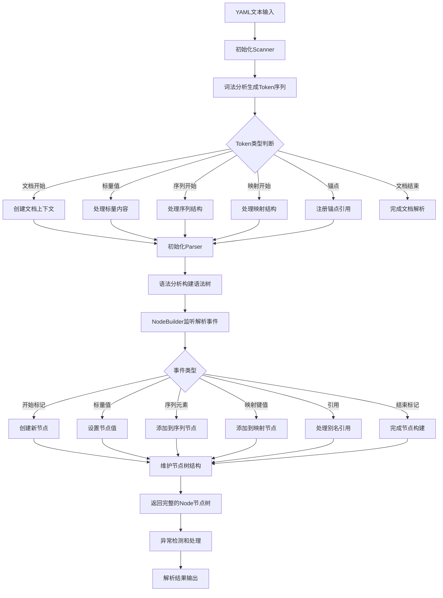
```mermaid
flowchart TD
    A[YAML文本输入] --> B[初始化Scanner]
    B --> C[词法分析生成Token序列]
    C --> D{Token类型判断}
    D -->|文档开始| E[创建文档上下文]
    D -->|标量值| F[处理标量内容]
    D -->|序列开始| G[处理序列结构]
    D -->|映射开始| H[处理映射结构]
    D -->|锚点| I[注册锚点引用]
    D -->|文档结束| J[完成文档解析]
    
    E --> K[初始化Parser]
    F --> K
    G --> K
    H --> K
    I --> K
    
    K --> L[语法分析构建语法树]
    L --> M[NodeBuilder监听解析事件]
    M --> N{事件类型}
    N -->|开始标记| O[创建新节点]
    N -->|标量值| P[设置节点值]
    N -->|序列元素| Q[添加到序列节点]
    N -->|映射键值| R[添加到映射节点]
    N -->|引用| S[处理别名引用]
    N -->|结束标记| T[完成节点构建]
    
    O --> U[维护节点树结构]
    P --> U
    Q --> U
    R --> U
    S --> U
    T --> U
    
    U --> V[返回完整的Node节点树]
    V --> W[异常检测和处理]
    W --> X[解析结果输出]
```

#### 3. 节点构建器（NodeBuilder）

**组件描述**：节点构建器负责在YAML解析过程中构建内存中的节点树结构，它通过事件驱动的方式接收解析事件，并逐步构建完整的配置数据结构。

**核心职责**：
- 监听YAML解析事件流
- 根据事件类型创建和管理节点
- 维护节点树的层次结构
- 处理YAML特有的引用和别名

**核心实现**：

```cpp
class NodeBuilder : public YAML::EventHandler {
public:
    NodeBuilder();
    ~NodeBuilder();
    
    // 获取构建完成的根节点
    YAML::Node getRoot();
    
    // EventHandler接口实现
    void OnDocumentStart(const YAML::Mark& mark) override;
    void OnDocumentEnd() override;
    
    void OnNull(const YAML::Mark& mark, const std::string& tag) override;
    void OnAlias(const YAML::Mark& mark, const std::string& anchor) override;
    void OnScalar(const YAML::Mark& mark, const std::string& tag,
                  const std::string& value) override;
    
    void OnSequenceStart(const YAML::Mark& mark, const std::string& tag,
                        const YAML::EmitterStyle::value style) override;
    void OnSequenceEnd() override;
    
    void OnMapStart(const YAML::Mark& mark, const std::string& tag,
                   const YAML::EmitterStyle::value style) override;
    void OnMapEnd() override;

private:
    // 节点栈管理
    std::stack<YAML::Node> nodeStack_;
    std::map<std::string, YAML::Node> anchors_;
    
    // 当前状态
    YAML::Node rootNode_;
    YAML::Node* currentNode_;
    
    // 辅助方法
    void pushNode(const YAML::Node& node);
    YAML::Node popNode();
    void registerAnchor(const std::string& anchor, const YAML::Node& node);
    YAML::Node getAnchor(const std::string& anchor) const;
    
    // 节点创建方法
    YAML::Node createScalarNode(const std::string& value, 
                               const std::string& tag);
    YAML::Node createSequenceNode();
    YAML::Node createMapNode();
    
    // 节点操作方法
    void appendToParent(const YAML::Node& node);
    void insertToParent(const std::string& key, const YAML::Node& node);
};
```

**节点构建流程**：

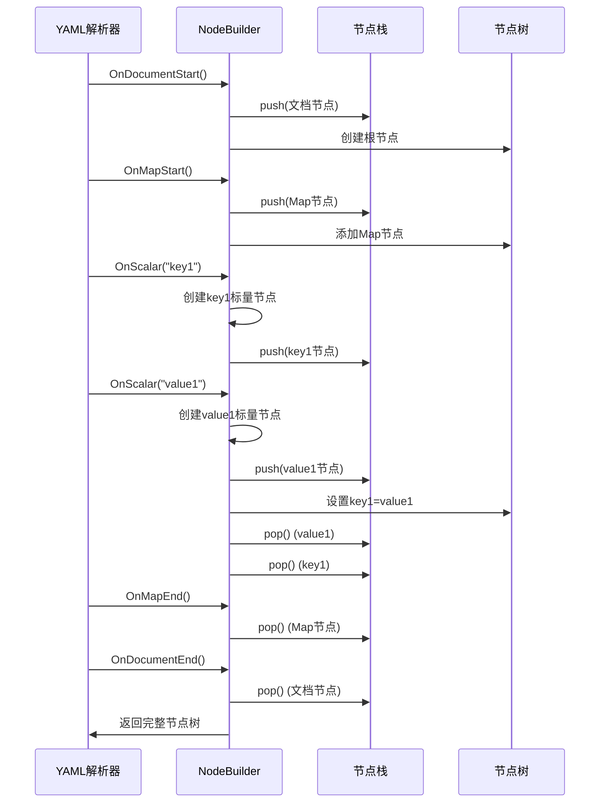
```mermaid
sequenceDiagram
    participant Parser as YAML解析器
    participant Builder as NodeBuilder
    participant Stack as 节点栈
    participant Tree as 节点树
    
    Parser->>Builder: OnDocumentStart()
    Builder->>Stack: push(文档节点)
    Builder->>Tree: 创建根节点
    
    Parser->>Builder: OnMapStart()
    Builder->>Stack: push(Map节点)
    Builder->>Tree: 添加Map节点
    
    Parser->>Builder: OnScalar("key1")
    Builder->>Builder: 创建key1标量节点
    Builder->>Stack: push(key1节点)
    
    Parser->>Builder: OnScalar("value1")
    Builder->>Builder: 创建value1标量节点
    Builder->>Stack: push(value1节点)
    Builder->>Tree: 设置key1=value1
    Builder->>Stack: pop() (value1)
    Builder->>Stack: pop() (key1)
    
    Parser->>Builder: OnMapEnd()
    Builder->>Stack: pop() (Map节点)
    
    Parser->>Builder: OnDocumentEnd()
    Builder->>Stack: pop() (文档节点)
    Builder->>Parser: 返回完整节点树
```

### 组件职责划分

MultiFormatConfigParser的组件职责划分遵循单一职责原则，每个组件都有明确的职责边界，确保了系统的高内聚性和可维护性。

#### 职责矩阵

| 组件名称 | 配置加载 | 配置保存 | 配置查询 | 配置更新 | 格式识别 | 错误处理 | 资源管理 |
|---------|---------|---------|---------|---------|---------|---------|---------|
| ConfigParserFactory | 辅助 | 辅助 | 辅助 | 辅助 | 主要 | 辅助 | 主要 |
| IConfigParser | 定义 | 定义 | 定义 | 定义 | 无关 | 定义 | 无关 |
| YamlConfigParser | 主要 | 主要 | 主要 | 主要 | 辅助 | 主要 | 主要 |
| JsonConfigParser | 主要 | 主要 | 主要 | 主要 | 辅助 | 主要 | 主要 |
| XmlConfigParser | 主要 | 主要 | 主要 | 主要 | 辅助 | 主要 | 主要 |
| TomlConfigParser | 主要 | 主要 | 主要 | 主要 | 辅助 | 主要 | 主要 |
| IniConfigParser | 主要 | 主要 | 主要 | 主要 | 辅助 | 主要 | 主要 |
| ExceptionFramework | 无关 | 无关 | 无关 | 无关 | 无关 | 主要 | 无关 |
| YamlParserEngine | 主要 | 辅助 | 无关 | 无关 | 辅助 | 主要 | 主要 |
| NodeBuilder | 主要 | 无关 | 无关 | 无关 | 无关 | 主要 | 主要 |

#### 职责边界定义

1. **创建型职责**：
   - **ConfigParserFactory**：负责解析器实例的创建和初始化
   - **边界**：不负责解析器的具体使用和生命周期管理

2. **接口定义职责**：
   - **IConfigParser**：负责定义配置操作的标准接口契约
   - **边界**：不提供任何具体实现，只定义行为规范

3. **格式处理职责**：
   - **各格式解析器**：负责特定格式配置文件的完整处理
   - **边界**：不处理其他格式，不负责格式识别逻辑

4. **错误处理职责**：
   - **ExceptionFramework**：负责系统异常的定义和处理机制
   - **边界**：不参与业务逻辑，只提供错误处理支持

5. **解析引擎职责**：
   - **YamlParserEngine**：负责YAML文档的底层解析
   - **边界**：不直接与用户交互，只提供解析服务

6. **节点构建职责**：
   - **NodeBuilder**：负责内存节点树的构建和管理
   - **边界**：不负责节点的持久化和业务逻辑处理

### 组件交互关系

组件间的交互关系构成了系统的动态行为模型，通过清晰的交互模式，系统实现了各组件间的有效协作。

#### 静态依赖关系

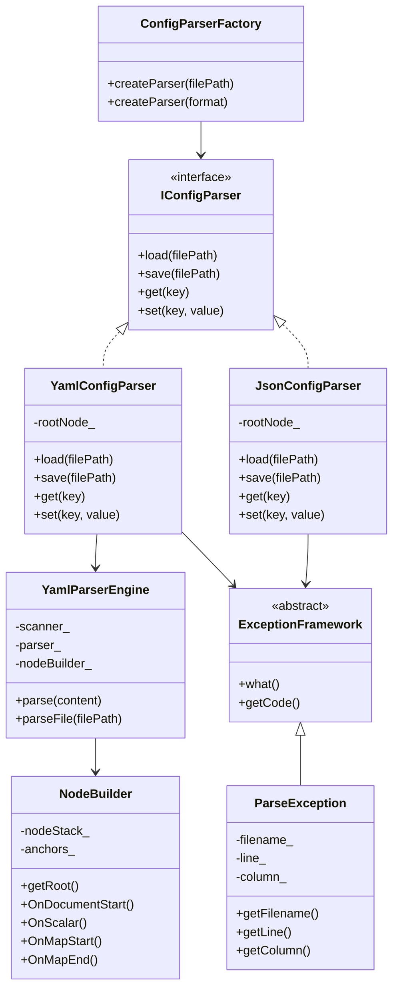
```mermaid
classDiagram
    class ConfigParserFactory {
        +createParser(filePath)
        +createParser(format)
    }
    
    class IConfigParser {
        <<interface>>
        +load(filePath)
        +save(filePath)
        +get(key)
        +set(key, value)
    }
    
    class YamlConfigParser {
        -rootNode_
        +load(filePath)
        +save(filePath)
        +get(key)
        +set(key, value)
    }
    
    class JsonConfigParser {
        -rootNode_
        +load(filePath)
        +save(filePath)
        +get(key)
        +set(key, value)
    }
    
    class YamlParserEngine {
        -scanner_
        -parser_
        -nodeBuilder_
        +parse(content)
        +parseFile(filePath)
    }
    
    class NodeBuilder {
        -nodeStack_
        -anchors_
        +getRoot()
        +OnDocumentStart()
        +OnScalar()
        +OnMapStart()
        +OnMapEnd()
    }
    
    class ExceptionFramework {
        <<abstract>>
        +what()
        +getCode()
    }
    
    class ParseException {
        -filename_
        -line_
        -column_
        +getFilename()
        +getLine()
        +getColumn()
    }
    
    ConfigParserFactory --> IConfigParser
    IConfigParser <|.. YamlConfigParser
    IConfigParser <|.. JsonConfigParser
    YamlConfigParser --> YamlParserEngine
    YamlParserEngine --> NodeBuilder
    YamlConfigParser --> ExceptionFramework
    JsonConfigParser --> ExceptionFramework
    ExceptionFramework <|-- ParseException
```

#### 动态协作模式

1. **创建协作模式**：

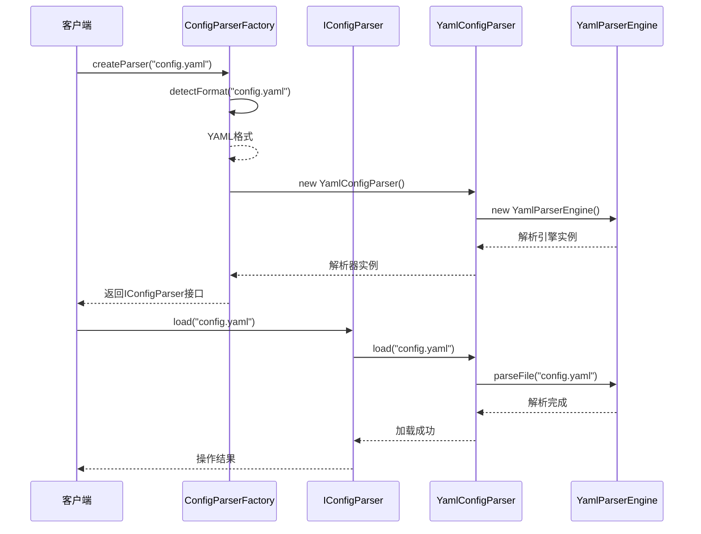
```mermaid
sequenceDiagram
    participant Client as 客户端
    participant Factory as ConfigParserFactory
    participant IConfigParser as IConfigParser
    participant YamlParser as YamlConfigParser
    participant YamlEngine as YamlParserEngine
    
    Client->>Factory: createParser("config.yaml")
    Factory->>Factory: detectFormat("config.yaml")
    Factory-->>Factory: YAML格式
    
    Factory->>YamlParser: new YamlConfigParser()
    YamlParser->>YamlEngine: new YamlParserEngine()
    YamlEngine-->>YamlParser: 解析引擎实例
    
    YamlParser-->>Factory: 解析器实例
    Factory-->>Client: 返回IConfigParser接口
    
    Client->>IConfigParser: load("config.yaml")
    IConfigParser->>YamlParser: load("config.yaml")
    YamlParser->>YamlEngine: parseFile("config.yaml")
    YamlEngine-->>YamlParser: 解析完成
    YamlParser-->>IConfigParser: 加载成功
    IConfigParser-->>Client: 操作结果
```

2. **配置访问协作模式**：

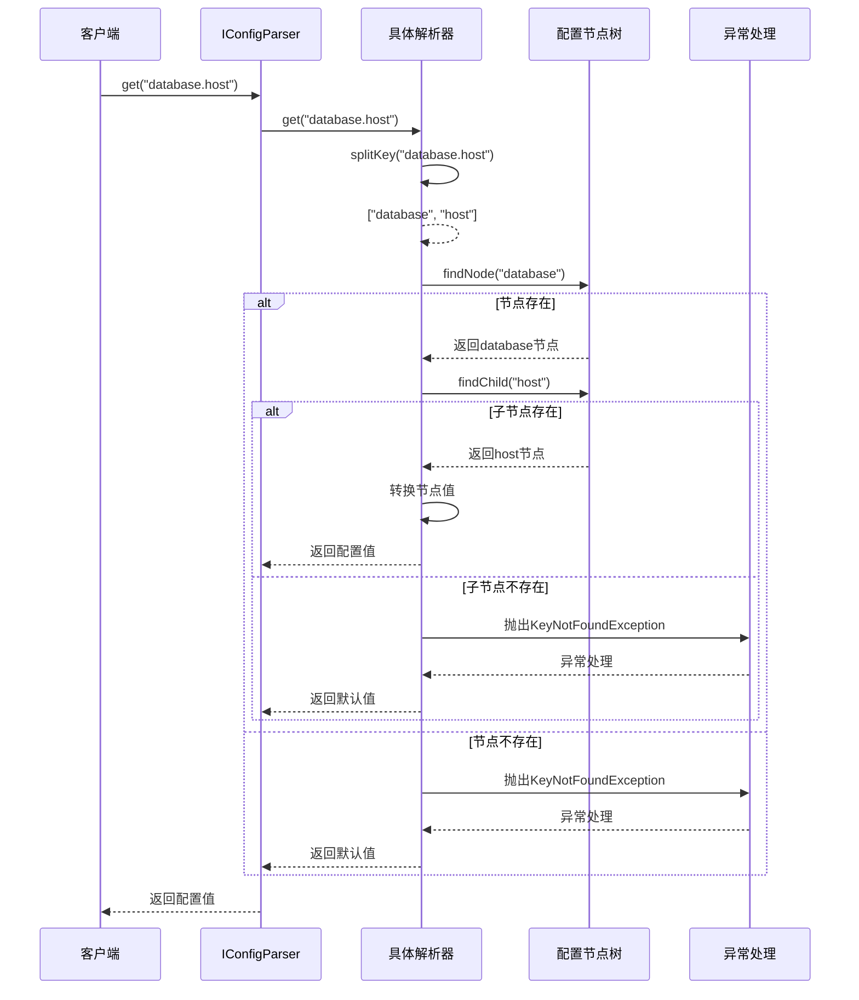
```mermaid
sequenceDiagram
    participant Client as 客户端
    participant Interface as IConfigParser
    participant Parser as 具体解析器
    participant NodeTree as 配置节点树
    participant Exception as 异常处理
    
    Client->>Interface: get("database.host")
    Interface->>Parser: get("database.host")
    
    Parser->>Parser: splitKey("database.host")
    Parser-->>Parser: ["database", "host"]
    
    Parser->>NodeTree: findNode("database")
    alt 节点存在
        NodeTree-->>Parser: 返回database节点
        Parser->>NodeTree: findChild("host")
        alt 子节点存在
            NodeTree-->>Parser: 返回host节点
            Parser->>Parser: 转换节点值
            Parser-->>Interface: 返回配置值
        else 子节点不存在
            Parser->>Exception: 抛出KeyNotFoundException
            Exception-->>Parser: 异常处理
            Parser-->>Interface: 返回默认值
        end
    else 节点不存在
        Parser->>Exception: 抛出KeyNotFoundException
        Exception-->>Parser: 异常处理
        Parser-->>Interface: 返回默认值
    end
    
    Interface-->>Client: 返回配置值
```

3. **错误处理协作模式**：

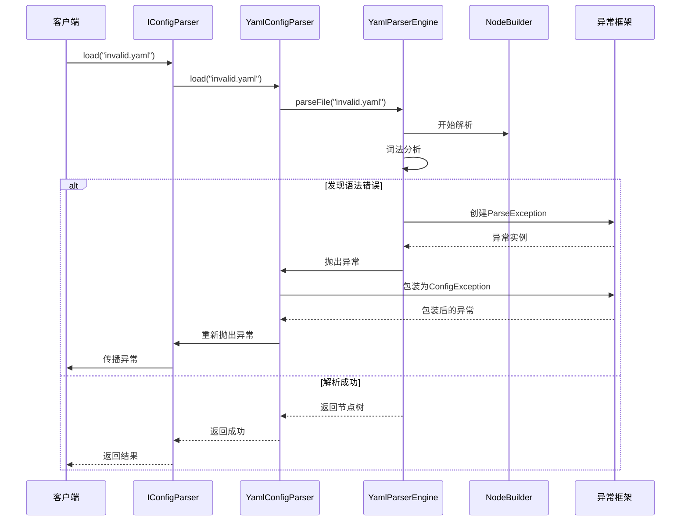
```mermaid
sequenceDiagram
    participant Client as 客户端
    participant Interface as IConfigParser
    participant Parser as YamlConfigParser
    participant Engine as YamlParserEngine
    participant Builder as NodeBuilder
    participant Exception as 异常框架
    
    Client->>Interface: load("invalid.yaml")
    Interface->>Parser: load("invalid.yaml")
    Parser->>Engine: parseFile("invalid.yaml")
    Engine->>Builder: 开始解析
    
    Engine->>Engine: 词法分析
    alt 发现语法错误
        Engine->>Exception: 创建ParseException
        Exception-->>Engine: 异常实例
        Engine->>Parser: 抛出异常
        Parser->>Exception: 包装为ConfigException
        Exception-->>Parser: 包装后的异常
        Parser->>Interface: 重新抛出异常
        Interface->>Client: 传播异常
    else 解析成功
        Engine-->>Parser: 返回节点树
        Parser-->>Interface: 返回成功
        Interface-->>Client: 返回结果
    end
```

通过精心设计的组件职责划分和交互关系，MultiFormatConfigParser实现了模块间的有效协作，确保了系统的可维护性、可扩展性和可靠性。每个组件都有明确的职责边界，通过定义良好的接口进行交互，形成了一个有机的整体系统。

## 5. 关键流程 (Key Processes)

### 核心功能流程

MultiFormatConfigParser的核心功能流程构成了系统的主干业务逻辑，这些流程确保了配置文件能够被正确加载、解析、修改和保存。通过分析这些流程，我们可以深入理解系统的工作原理和设计思想。

#### 1. 多格式配置文件统一处理流程

**流程描述**：多格式配置文件统一处理流程是系统的主干工作流程，实现了一个完整的配置文件生命周期管理。该流程从用户发起配置操作开始，通过统一的接口层屏蔽不同格式间的技术差异，将具体操作委托给对应格式的专用解析器，最终完成配置文件的加载、解析、修改和保存。流程采用了工厂模式和适配器模式的组合，实现了格式透明的配置管理，为上层应用提供标准化的配置访问能力。

**流程图**：

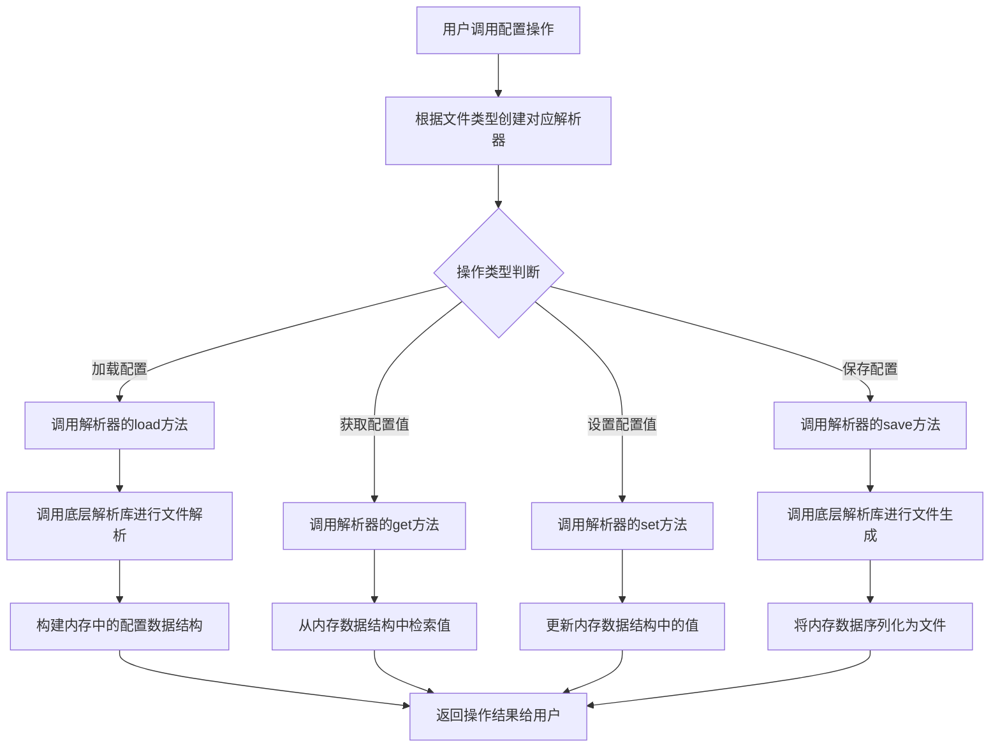
```mermaid
flowchart TD
    A[用户调用配置操作] --> B[根据文件类型创建对应解析器]
    B --> C{操作类型判断}
    C -->|加载配置| D[调用解析器的load方法]
    C -->|获取配置值| E[调用解析器的get方法]
    C -->|设置配置值| F[调用解析器的set方法]
    C -->|保存配置| G[调用解析器的save方法]
    D --> H[调用底层解析库进行文件解析]
    H --> I[构建内存中的配置数据结构]
    E --> J[从内存数据结构中检索值]
    F --> K[更新内存数据结构中的值]
    G --> L[调用底层解析库进行文件生成]
    L --> M[将内存数据序列化为文件]
    I --> N[返回操作结果给用户]
    J --> N
    K --> N
    M --> N
```

**流程详细步骤**：

1. **用户发起配置操作**：
   - 用户通过应用程序调用配置操作接口
   - 提供配置文件路径和操作类型参数
   - 系统接收操作请求并准备处理

2. **根据文件类型创建对应解析器**：
   - ConfigParserFactory检测文件扩展名
   - 根据扩展名确定配置文件格式
   - 创建对应格式的解析器实例
   - 返回统一的IConfigParser接口

3. **操作类型判断**：
   - 系统根据方法调用确定操作类型
   - 支持的操作类型包括加载、获取、设置、保存
   - 将操作委托给解析器的相应方法

4. **加载配置**分支：
   - 调用解析器的load方法
   - 解析器调用底层解析库进行文件解析
   - 构建内存中的配置数据结构
   - 返回加载结果

5. **获取配置值**分支：
   - 调用解析器的get方法
   - 从内存数据结构中检索指定配置值
   - 处理类型转换和默认值
   - 返回配置值

6. **设置配置值**分支：
   - 调用解析器的set方法
   - 更新内存数据结构中的值
   - 处理嵌套配置项的创建
   - 返回设置结果

7. **保存配置**分支：
   - 调用解析器的save方法
   - 调用底层解析库进行文件生成
   - 将内存数据序列化为文件
   - 返回保存结果

8. **返回操作结果**：
   - 汇总各种操作的结果
   - 统一返回给用户
   - 包含成功/失败状态和相关信息

**关键设计决策**：
- **统一接口**：通过IConfigParser接口屏蔽格式差异
- **工厂模式**：使用工厂创建解析器，实现格式透明处理
- **内存缓存**：配置数据在内存中缓存，提高访问效率
- **延迟加载**：配置文件按需加载，避免不必要的IO操作

#### 2. YAML配置文件处理流程

**流程描述**：YAML配置文件处理流程是系统中最重要且最复杂的单个格式处理流程，实现了YAML格式配置文件的完整生命周期管理。该流程基于yaml-cpp库的强大解析能力，通过词法分析、语法解析、节点构建等多个阶段，将YAML文本转换为内存中的可操作数据结构，并支持读写操作后的保存。流程中包含了完整的错误处理和异常管理机制，确保YAML配置处理的稳定性和可靠性。

**流程图**：

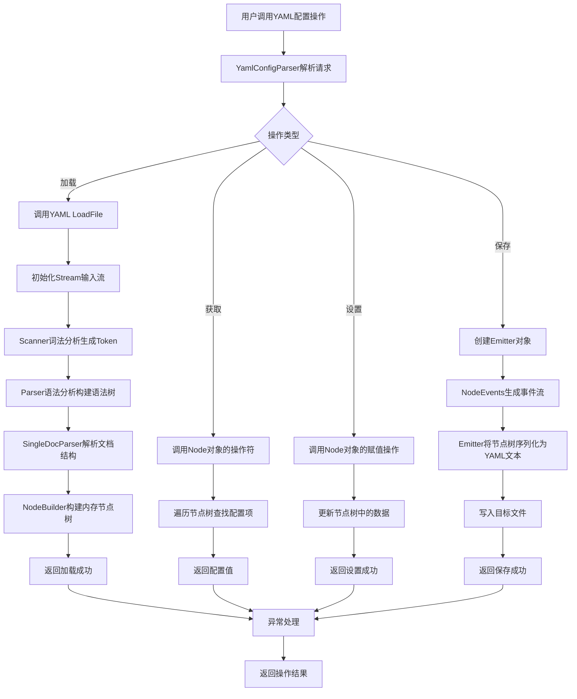
```mermaid
flowchart TD
    A[用户调用YAML配置操作] --> B[YamlConfigParser解析请求]
    B --> C{操作类型}
    C -->|"加载"| D[调用YAML LoadFile]
    D --> E[初始化Stream输入流]
    E --> F[Scanner词法分析生成Token]
    F --> G[Parser语法分析构建语法树]
    G --> H[SingleDocParser解析文档结构]
    H --> I[NodeBuilder构建内存节点树]
    I --> J[返回加载成功]
    C -->|"获取"| K[调用Node对象的操作符]
    K --> L[遍历节点树查找配置项]
    L --> M[返回配置值]
    C -->|"设置"| N[调用Node对象的赋值操作]
    N --> O[更新节点树中的数据]
    O --> P[返回设置成功]
    C -->|"保存"| Q[创建Emitter对象]
    Q --> R[NodeEvents生成事件流]
    R --> S[Emitter将节点树序列化为YAML文本]
    S --> T[写入目标文件]
    T --> U[返回保存成功]
    J --> V[异常处理]
    M --> V
    P --> V
    U --> V
    V --> W[返回操作结果]
```

**流程详细步骤**：

1. **用户调用YAML配置操作**：
   - 用户通过YamlConfigParser接口调用配置操作
   - 提供配置文件路径和操作参数
   - 系统接收请求并准备处理

2. **YamlConfigParser解析请求**：
   - YamlConfigParser接收操作请求
   - 根据操作类型分发到相应的处理方法
   - 准备操作所需的资源和上下文

3. **操作类型判断**：
   - 系统根据方法调用确定操作类型
   - 支持加载、获取、设置、保存四种操作
   - 每种操作有不同的处理路径

4. **加载配置**分支：
   - 调用YAML::LoadFile函数
   - 初始化Stream输入流处理文件内容
   - Scanner进行词法分析生成Token序列
   - Parser进行语法分析构建语法树
   - SingleDocParser解析文档结构
   - NodeBuilder构建内存节点树
   - 返回加载成功结果

5. **获取配置值**分支：
   - 调用Node对象的[]操作符
   - 遍历节点树查找指定的配置项
   - 处理路径解析和节点定位
   - 返回配置值

6. **设置配置值**分支：
   - 调用Node对象的赋值操作
   - 更新节点树中的数据
   - 处理嵌套节点的创建和更新
   - 返回设置成功结果

7. **保存配置**分支：
   - 创建Emitter对象用于序列化
   - NodeEvents生成事件流
   - Emitter将节点树序列化为YAML文本
   - 将序列化结果写入目标文件
   - 返回保存成功结果

8. **异常处理**：
   - 捕获和处理各种异常情况
   - 包括文件IO异常、解析异常、类型转换异常等
   - 提供详细的错误信息和上下文

9. **返回操作结果**：
   - 汇总操作结果和异常信息
   - 统一返回给用户
   - 包含操作状态和详细信息

**关键技术点**：
- **事件驱动解析**：YAML解析采用事件驱动架构，提高解析效率
- **节点树构建**：内存中构建完整的节点树结构，支持复杂查询
- **类型安全**：严格的类型检查和转换，确保数据一致性
- **异常安全**：全面的异常处理机制，保证系统稳定性

#### 3. 配置解析器工厂创建流程

**流程描述**：配置解析器工厂创建流程负责根据配置文件格式动态创建对应的解析器实例，实现了系统对多种配置格式的灵活支持。该流程采用工厂模式，通过输入的文件类型或格式标识，智能选择并初始化相应的解析器，为上层应用提供统一的配置操作入口。流程中包含对格式的自动识别和解析器的生命周期管理，确保创建过程的准确性和效率。

**流程图**：

```mermaid
flowchart TD
    A[配置操作请求] --> B[检测配置文件类型]
    B --> C{文件格式识别}
    C -->|YAML| D[创建YamlConfigParser实例]
    C -->|XML| E[创建XmlConfigParser实例]
    C -->|TOML| F[创建TomlConfigParser实例]
    C -->|INI| G[创建IniConfigParser实例]
    C -->|JSON| H[创建JsonConfigParser实例]
    D --> I[初始化yaml-cpp库相关组件]
