# 核心工作流程

## 1. 工作流程概览

### 1.1 系统主干工作流程

多格式配置文件解析器系统的主干工作流程是一个完整的**配置文件生命周期管理流程**，实现了从用户配置操作请求到最终配置文件处理的端到端解决方案。该流程采用**分层架构设计**和**工厂模式**，通过统一的接口层屏蔽不同配置格式间的技术差异，为上层应用提供标准化的配置管理能力。

系统主干工作流程的核心特征：
- **格式透明性**：用户无需关心底层配置格式，通过统一接口进行操作
- **可扩展性**：支持多种配置格式的插拔式扩展
- **一致性**：所有格式配置操作遵循统一的接口规范
- **健壮性**：具备完善的异常处理和错误恢复机制

### 1.2 核心执行路径

系统的核心执行路径遵循以下关键步骤：

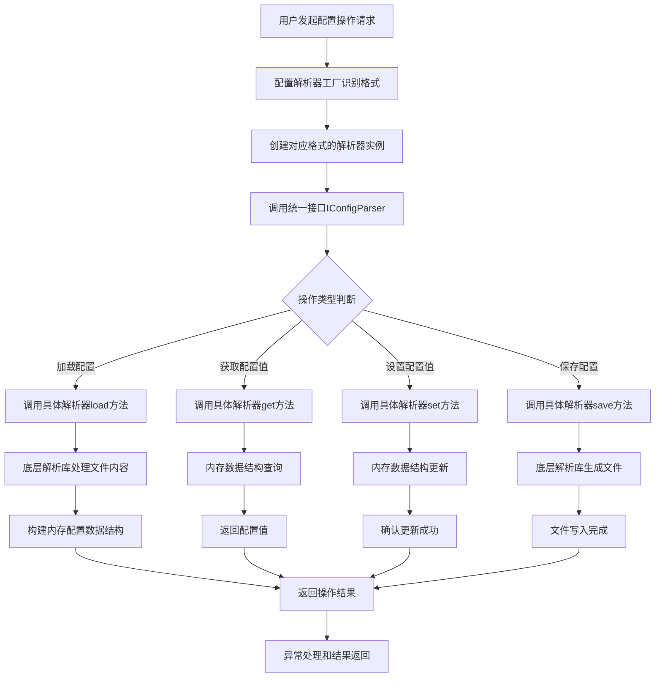

### 1.3 关键流程节点

系统工作流程中的关键节点包括：

1. **格式识别节点**：配置解析器工厂根据文件扩展名或内容特征识别配置文件格式
2. **解析器创建节点**：动态创建对应的格式解析器实例，初始化底层依赖库
3. **接口调用节点**：通过统一接口IConfigParser进行配置操作
4. **数据转换节点**：在文件格式和内存数据结构之间进行双向转换
5. **异常处理节点**：捕获和处理各阶段可能出现的异常情况
6. **资源管理节点**：管理文件句柄、内存资源等系统资源

### 1.4 流程协调机制

系统采用多层次的流程协调机制：

- **工厂模式协调**：通过ConfigParserFactory统一管理解析器的创建和生命周期
- **适配器模式协调**：各格式解析器实现统一接口，适配底层解析库的差异
- **事件驱动协调**：YAML处理采用事件驱动机制，实现解析和构建的松耦合
- **状态管理协调**：通过内存中的配置数据结构维护配置状态的一致性

## 2. 主要工作流程

### 2.1 多格式配置文件统一处理流程

#### 2.1.1 流程描述

多格式配置文件统一处理流程是系统的**核心业务流程**，实现了配置文件的完整生命周期管理。该流程通过统一的接口层屏蔽不同格式间的技术差异，将具体操作委托给对应格式的专用解析器，最终完成配置文件的加载、解析、修改和保存。

#### 2.1.2 详细执行步骤

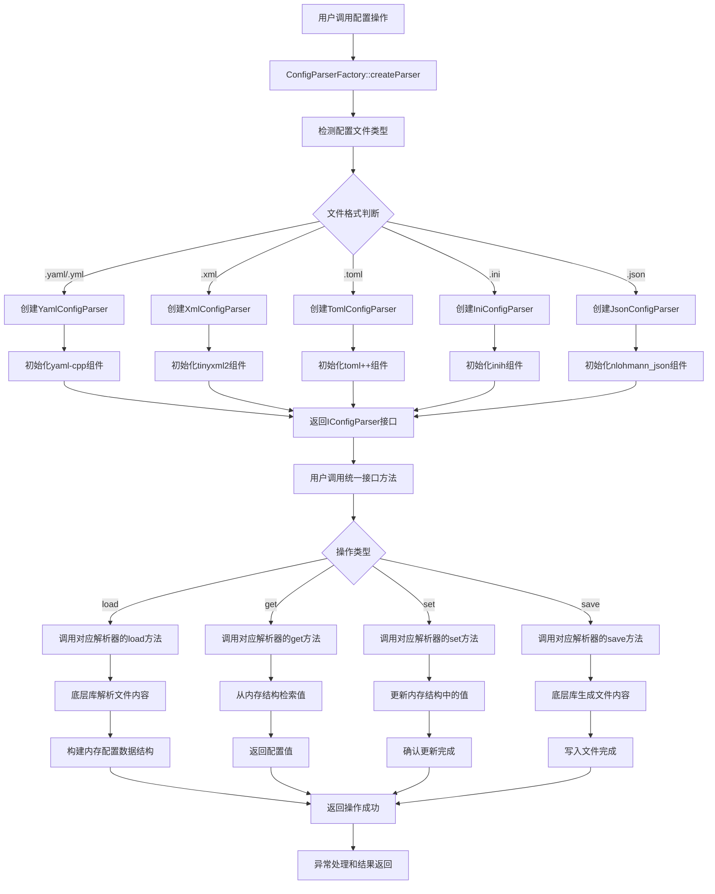

#### 2.1.3 关键技术细节

- **格式识别算法**：基于文件扩展名和内容特征的双重识别机制
- **解析器池管理**：采用对象池模式管理解析器实例，提高性能
- **内存数据结构**：使用统一的键值对结构存储配置数据
- **线程安全机制**：通过互斥锁保证多线程环境下的数据一致性

### 2.2 YAML配置文件处理流程

#### 2.2.1 流程描述

YAML配置文件处理流程是系统中最重要且最复杂的单个格式处理流程，基于yaml-cpp库实现了YAML格式配置文件的完整生命周期管理。该流程包含词法分析、语法解析、节点构建等多个技术阶段，严格遵循YAML 1.2规范。

#### 2.2.2 详细执行步骤

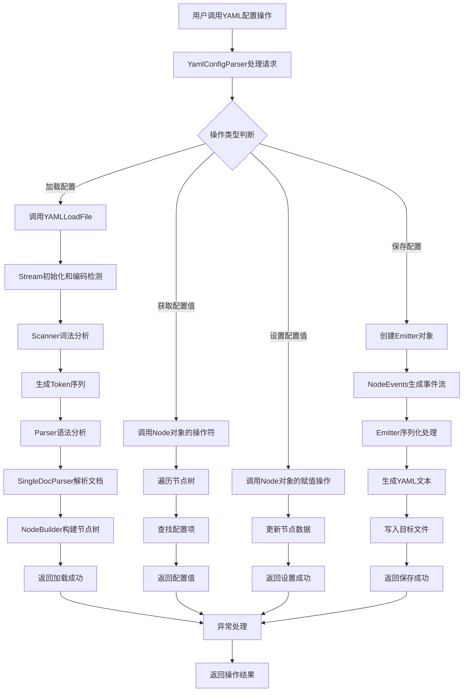

#### 2.2.3 底层技术实现

**词法分析阶段**：
- Scanner组件通过有限状态自动机处理YAML语法
- 识别文档开始/结束标记、流程控制标记、块结构等
- 维护解析上下文状态，包括缩进层级、简单键等

**语法分析阶段**：
- Parser组件采用递归下降解析策略
- 处理YAML指令、锚点、标签、标量值等语法元素
- 通过EventHandler接口产生解析事件

**节点构建阶段**：
- NodeBuilder组件监听解析事件，动态构建节点树
- 管理节点内存、处理锚点和别名引用
- 维护构建上下文栈，支持复杂嵌套结构

### 2.3 YAML文档解析底层流程

#### 2.3.1 流程描述

YAML文档解析底层流程是YAML配置处理的技术基础，实现了从原始YAML文本到内存节点树的完整转换过程。该流程采用事件驱动架构，通过多阶段处理确保文档解析的准确性和完整性。

#### 2.3.2 详细执行步骤

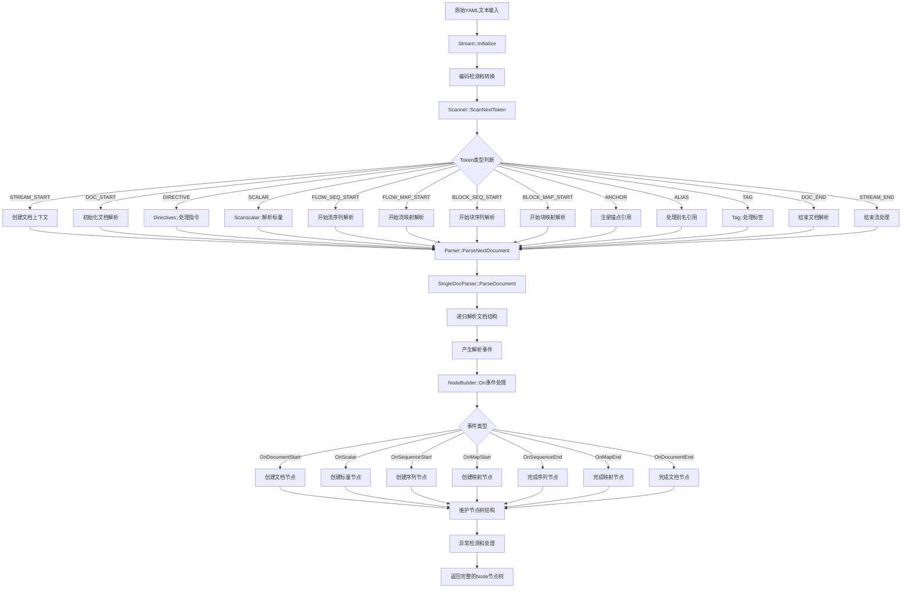

#### 2.3.3 关键技术组件

**Stream组件**：
- 处理多字符集编码的自动检测和转换
- 支持UTF-8、UTF-16LE/BE、UTF-32LE/BE等编码格式
- 通过BOM标记识别编码类型
- 维护位置信息用于错误报告

**Scanner组件**：
- 实现复杂的YAML语法解析逻辑
- 通过有限状态自动机处理各种语法结构
- 维护解析上下文状态（缩进、简单键、流程上下文等）
- 采用延迟扫描策略提高效率

**Parser组件**：
- 实现YAML 1.2规范的语法解析
- 处理文档加载、指令解析等功能
- 通过SingleDocParser处理单个文档解析
- 具备完善的异常处理机制

## 3. 流程协调与控制

### 3.1 多模块协调机制

系统采用多种设计模式实现模块间的有效协调：

#### 3.1.1 工厂模式协调

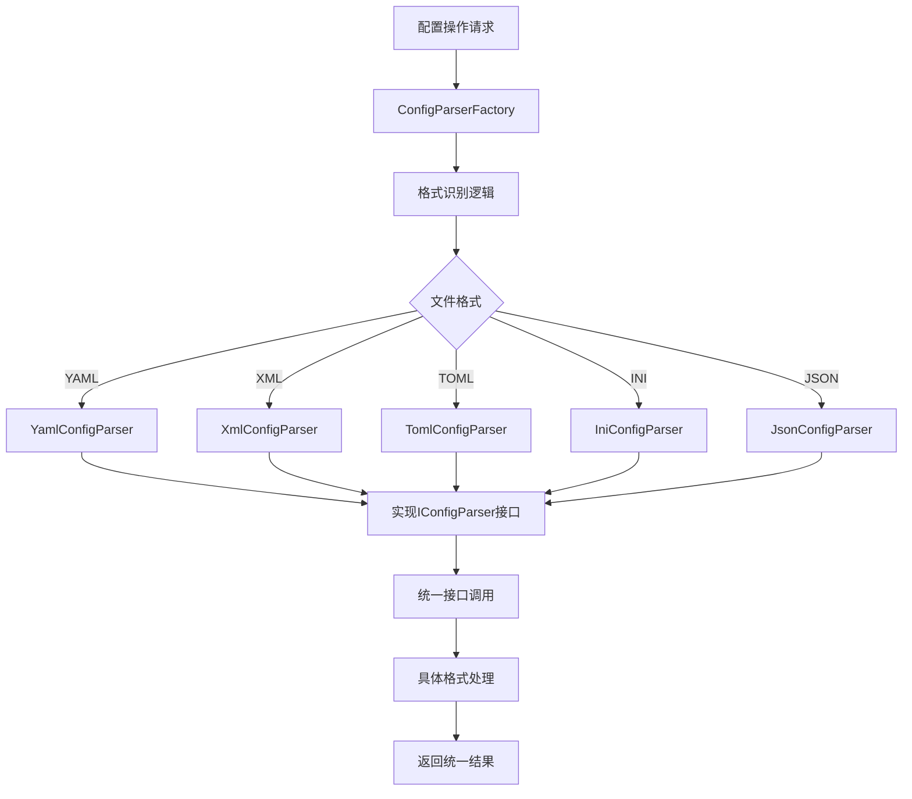

**协调特点**：
- **集中管理**：所有解析器创建逻辑集中在工厂类中
- **类型安全**：通过接口约束确保解析器实现的一致性
- **可扩展性**：新增格式支持只需扩展工厂类，无需修改现有代码
- **生命周期管理**：工厂负责解析器实例的创建和销毁

#### 3.1.2 适配器模式协调

各格式解析器通过适配器模式封装底层解析库的差异：

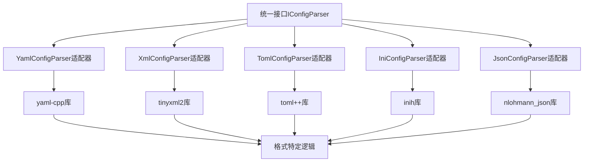

**适配功能**：
- **接口转换**：将第三方库的特定接口转换为统一接口
- **数据格式转换**：处理不同格式间的数据结构差异
- **错误处理适配**：统一不同库的异常处理机制
- **性能优化**：针对特定格式进行适配层优化

### 3.2 状态管理和同步

#### 3.2.1 配置状态管理

系统通过内存中的配置数据结构维护配置状态：

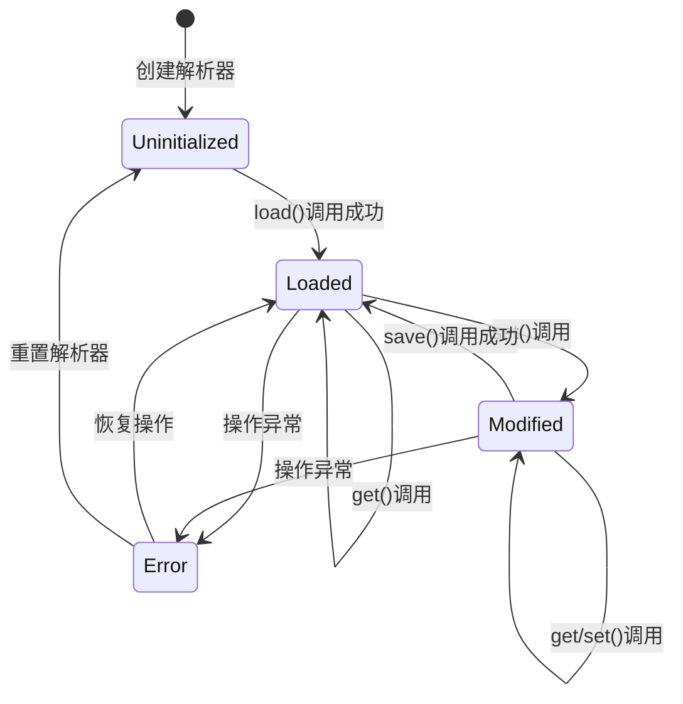

**状态转换规则**：
- **Uninitialized（未初始化）**：解析器创建后的初始状态
- **Loaded（已加载）**：配置文件成功加载到内存
- **Modified（已修改）**：配置数据被修改但未保存
- **Error（错误状态）**：操作过程中出现异常

#### 3.2.2 线程同步机制

系统采用多层次的线程同步策略：

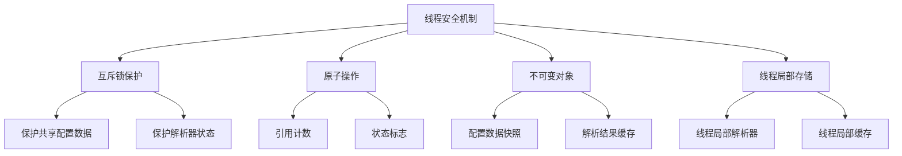

**同步策略**：
- **细粒度锁**：针对不同的数据结构使用独立的锁
- **读写锁**：区分读操作和写操作的同步需求
- **无锁设计**：对于只读配置数据采用不可变对象设计
- **线程局部存储**：减少共享数据的竞争

### 3.3 数据传递和共享

#### 3.3.1 数据流转机制

系统内部数据流转遵循以下模式：


**数据流转特点**：
- **双向流动**：支持配置数据的读取和写入
- **格式转换**：在文件格式和内存结构间进行转换
- **缓存机制**：避免重复的文件解析操作
- **延迟加载**：按需加载配置数据，提高性能

#### 3.3.2 共享数据管理

系统采用多种机制管理共享数据：

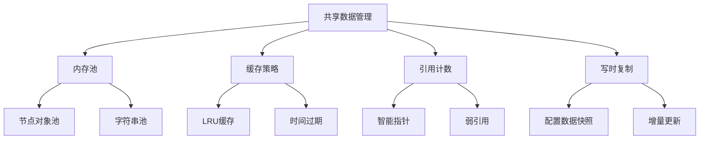

**管理策略**：
- **内存池技术**：减少频繁的内存分配和释放
- **智能缓存**：根据访问模式优化缓存策略
- **引用计数**：自动管理对象的生命周期
- **写时复制**：提高并发读取性能

### 3.4 执行控制和调度

#### 3.4.1 任务调度机制

系统支持多种执行模式：

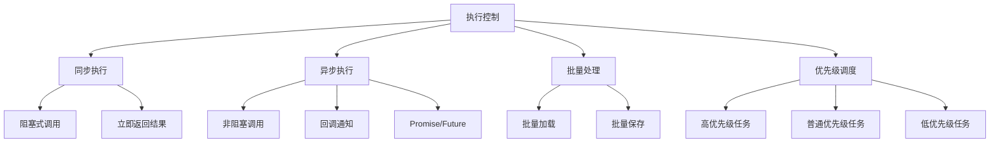

**调度策略**：
- **同步优先**：默认采用同步执行模式，保证数据一致性
- **异步支持**：对于耗时操作提供异步执行选项
- **批量优化**：支持批量配置操作，提高效率
- **优先级管理**：根据操作重要性进行调度

#### 3.4.2 性能监控和调优

系统内置性能监控机制：

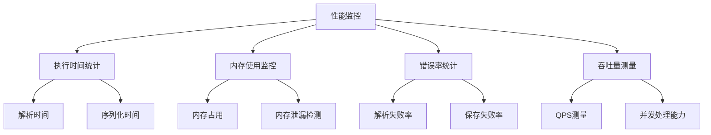

**监控指标**：
- **时间指标**：解析时间、序列化时间、响应时间
- **资源指标**：内存使用、CPU占用、文件句柄数
- **质量指标**：成功率、错误率、异常频率
- **性能指标**：吞吐量、并发能力、响应延迟

## 4. 异常处理与恢复

### 4.1 错误检测和处理

#### 4.1.1 错误分类体系

系统建立了完整的错误分类和处理机制：

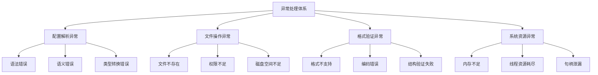

**错误处理原则**：
- **快速失败**：检测到错误立即抛出异常，避免状态污染
- **精确诊断**：提供详细的错误信息和上下文
- **分级处理**：根据错误严重程度采用不同处理策略
- **可恢复性**：尽可能提供恢复机制

#### 4.1.2 异常处理流程

系统的异常处理遵循标准化流程：

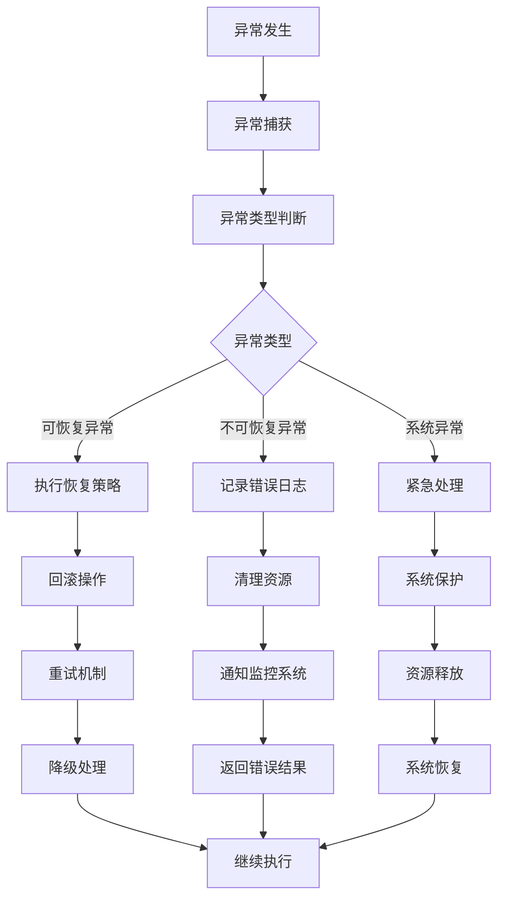

**处理策略**：
- **try-catch块**：在关键操作周围设置异常捕获
- **异常链**：保持异常的完整调用栈信息
- **资源清理**：确保异常情况下资源的正确释放
- **错误传播**：将异常信息传递给合适的处理层

### 4.2 异常恢复机制

#### 4.2.1 自动重试机制

系统实现了智能的自动重试机制：

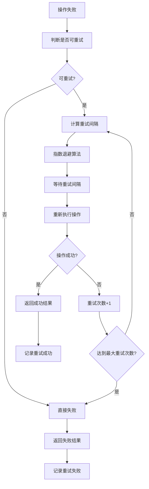

**重试策略**：
- **重试条件**：仅对暂时性错误进行重试
- **退避算法**：采用指数退避避免雪崩效应
- **重试限制**：设置最大重试次数和超时时间
- **重试监控**：记录重试统计信息用于优化

#### 4.2.2 状态回滚机制

系统支持操作失败时的状态回滚：

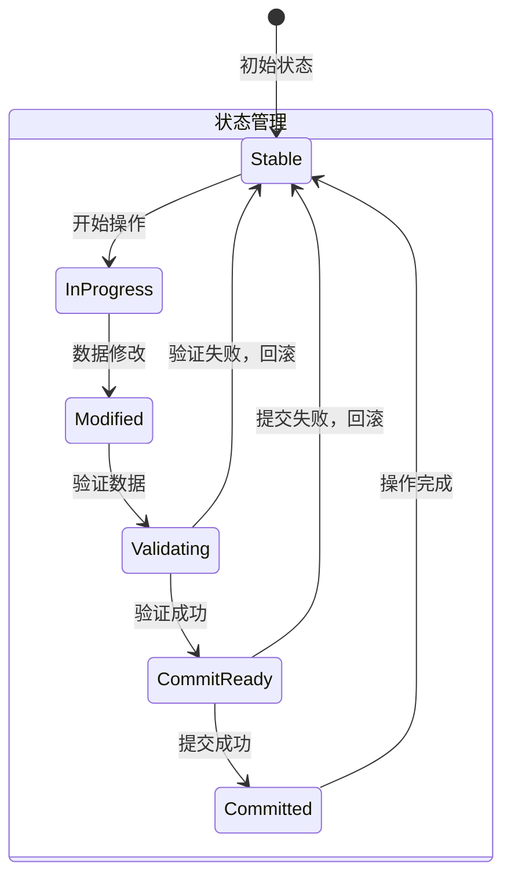

**回滚机制**：
- **事务性操作**：关键操作采用事务模式
- **状态快照**：在操作前保存状态快照
- **原子性保证**：确保操作的原子性执行
- **一致性维护**：回滚后保持数据一致性

### 4.3 容错策略设计

#### 4.3.1 降级处理策略

系统设计了多层次的降级处理机制：

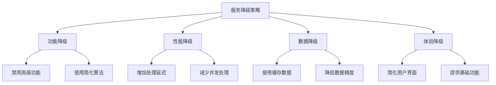

**降级原则**：
- **优雅降级**：在资源受限时保持核心功能
- **渐进降级**：根据资源状况逐步降级
- **用户感知**：向用户提供清晰的降级信息
- **自动恢复**：条件允许时自动恢复正常服务

#### 4.3.2 熔断保护机制

系统实现了熔断保护机制防止级联故障：

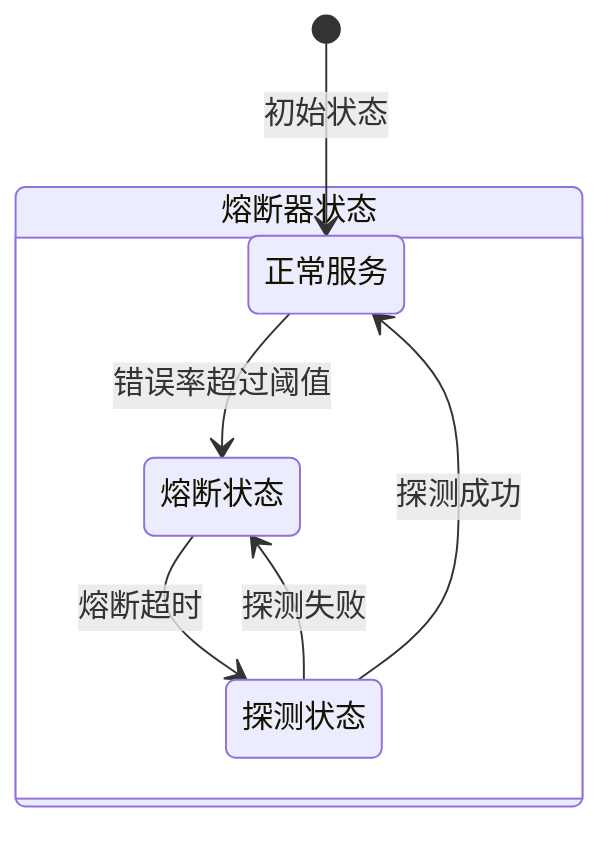

**熔断策略**：
- **错误率监控**：实时监控操作错误率
- **熔断阈值**：设置合理的熔断触发条件
- **恢复探测**：定期探测服务是否恢复
- **熔断通知**：及时通知相关系统熔断状态

### 4.4 失败重试和降级

#### 4.4.1 重试策略配置

系统支持灵活的重试策略配置：

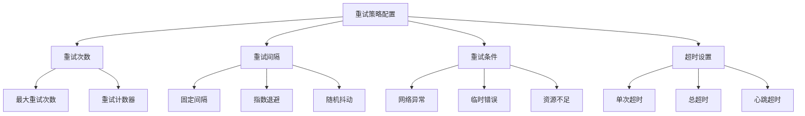

**配置维度**：
- **重试参数**：次数、间隔、超时等基本参数
- **重试条件**：哪些异常类型可以重试
- **重试策略**：固定间隔、指数退避等算法选择
- **监控指标**：重试成功率、重试分布等统计

#### 4.4.2 降级策略实施

降级策略的实施遵循以下原则：

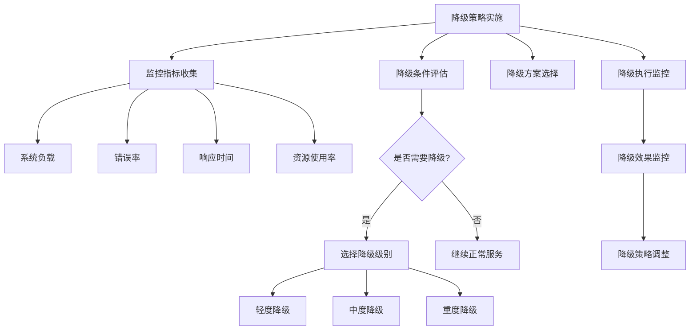

**实施要点**：
- **指标驱动**：基于系统指标自动触发降级
- **分级降级**：根据系统状况选择合适的降级级别
- **动态调整**：根据降级效果动态调整策略
- **恢复机制**：条件允许时自动恢复服务级别

## 5. 关键流程实现

### 5.1 核心算法流程

#### 5.1.1 YAML解析算法流程

YAML解析采用递归下降的解析算法，实现复杂文档结构的准确解析：

```mermaid
flowchart TD
    A[YAML解析算法] --> B[Token流生成]
    B --> C[语法分析]
    C --> D[AST构建]
    D --> E[语义验证]
    
    B --> F[Scanner::ScanNextToken]
    F --> G[字符流处理]
    G --> H[Token识别]
    H --> I[Token序列输出]
    
    C --> J[Parser::ParseNextDocument]
    J --> K[语法规则匹配]
    K --> L[语法树构建]
    L --> M[语法验证]
    
    D --> N[NodeBuilder::Build]
    N --> O[事件监听]
    O --> P[节点创建]
    P --> Q[节点关联]
    Q --> R[AST完成]
    
    E --> S[语义规则检查]
    S --> T[引用解析]
    T --> U[类型验证]
    U --> V[完整性检查]
```

**算法特点**：
- **多阶段处理**：词法分析、语法分析、语义分析分层处理
- **事件驱动**：通过事件机制实现组件间的松耦合
- **递归下降**：支持复杂嵌套结构的递归解析
- **错误恢复**：具备语法错误的检测和恢复能力

#### 5.1.2 配置文件格式识别算法

格式识别算法采用多特征融合的识别策略：

```mermaid
flowchart TD
    A[格式识别算法] --> B[文件扩展名分析]
    A --> C[内容特征分析]
    A --> D[文件头特征]
    A --> E[统计特征分析]
    
    B --> F[扩展名映射]
    F --> G[格式候选集]
    
    C --> H[关键字检测]
    H --> I[语法特征]
    I --> J[格式置信度]
    
    D --> K[魔数检测]
    K --> L[编码识别]
    L --> M[格式验证]
    
    E --> N[字符分布]
    N --> O[结构特征]
    O --> P[格式概率]
    
    G --> Q[特征融合]
    J --> Q
    M --> Q
    P --> Q
    Q --> R[最终格式判断]
```

**识别策略**：
- **多特征融合**：结合多种特征进行综合判断
- **置信度评估**：为每种格式计算识别置信度
- **动态学习**：根据识别结果动态调整识别权重
- **人工干预**：支持人工指定格式的优先级

### 5.2 数据处理管道

#### 5.2.1 配置数据处理管道

配置数据处理采用流水线架构，实现高效的数据转换：

```mermaid
flowchart TD
    A[数据处理管道] --> B[输入阶段]
    A --> C[解析阶段]
    A --> D[转换阶段]
    A --> E[输出阶段]
    
    B --> F[文件读取]
    F --> G[编码检测]
    G --> H[流式输入]
    
    C --> I[词法分析]
    I --> J[语法分析]
    J --> K[结构解析]
    
    D --> L[类型转换]
    L --> M[数据验证]
    M --> N[标准化处理]
    
    E --> O[格式化输出]
    O --> P[文件写入]
    P --> Q[缓存更新]
```

**管道特点**：
- **流式处理**：支持大文件的流式处理，减少内存占用
- **并行处理**：各阶段可以并行执行，提高处理效率
- **容错处理**：每个阶段都有独立的错误处理机制
- **性能优化**：通过缓存和预处理优化管道性能

#### 5.2.2 内存管理管道

内存管理采用多层次的资源管理策略：

```mermaid
flowchart TD
    A[内存管理管道] --> B[内存分配]
    A --> C[内存使用]
    A --> D[内存回收]
    A --> E[内存优化]
    
    B --> F[内存池管理]
    F --> G[对象分配]
    G --> H[内存对齐]
    
    C --> I[引用计数]
    I --> J[内存访问]
    J --> K[边界检查]
    
    D --> L[垃圾回收]
    L --> M[内存释放]
    M --> N[碎片整理]
    
    E --> O[内存压缩]
    O --> P[缓存清理]
    P --> Q[内存预分配]
```

**管理策略**：
- **池化技术**：使用内存池减少分配开销
- **智能指针**：通过引用计数自动管理内存生命周期
- **垃圾回收**：定期清理无用的内存资源
- **内存优化**：通过压缩和预分配优化内存使用

### 5.3 业务规则执行

#### 5.3.1 配置验证规则执行

配置数据验证采用规则引擎模式，支持灵活的验证规则：

```mermaid
flowchart TD
    A[配置验证规则] --> B[语法验证]
    A --> C[语义验证]
    A --> D[业务验证]
    A --> E[完整性验证]
    
    B --> F[格式规范检查]
    F --> G[语法结构验证]
    G --> H[关键字检查]
    
    C --> I[数据类型验证]
    I --> J[值范围检查]
    J --> K[依赖关系验证]
    
    D --> L[业务规则检查]
    L --> M[权限验证]
    M --> N[合规性检查]
    
    E --> O[引用完整性]
    O --> P[数据一致性]
    P --> Q[逻辑完整性]
```

**验证规则**：
- **分层验证**：语法、语义、业务、完整性分层验证
- **规则可配置**：支持动态配置验证规则
- **错误定位**：提供精确的错误位置和原因
- **批量验证**：支持批量配置数据的验证

#### 5.3.2 配置更新规则执行

配置更新遵循严格的业务规则，确保数据的一致性：

```mermaid
flowchart TD
    A[配置更新规则] --> B[更新前检查]
    A --> C[更新执行]
    A --> D[更新后验证]
    A --> E[变更通知]
    
    B --> F[权限检查]
    F --> G[数据有效性]
    G --> H[依赖关系]
    
    C --> I[原子更新]
    I --> J[事务处理]
    J --> K[状态同步]
    
    D --> L[一致性验证]
    L --> M[完整性检查]
    M --> N[业务规则验证]
    
    E --> O[监听器通知]
    O --> P[缓存更新]
    P --> Q[日志记录]
```

**更新规则**：
- **原子性**：配置更新要么全部成功，要么全部失败
- **一致性**：更新后保持数据的一致性状态
- **隔离性**：并发更新不会相互干扰
- **持久性**：更新结果持久保存不会丢失

### 5.4 技术实现细节

#### 5.4.1 并发处理实现

系统采用多种并发处理技术提高性能：

```mermaid
flowchart TD
    A[并发处理技术] --> B[多线程架构]
    A --> C[异步I/O]
    A --> D[无锁数据结构]
    A --> E[任务并行化]
    
    B --> F[线程池管理]
    F --> G[任务队列]
    G --> H[负载均衡]
    
    C --> I[非阻塞I/O]
    I --> J[I/O多路复用]
    J --> K[事件驱动]
    
    D --> L[原子操作]
    L --> M[无锁队列]
    M --> N[无锁哈希表]
    
    E --> O[任务分解]
    O --> P[并行执行]
    P --> Q[结果合并]
```

**并发特点**：
- **线程安全**：所有共享数据都采用线程安全设计
- **无锁优化**：对于高频操作使用无锁数据结构
- **异步处理**：I/O操作采用异步模式提高吞吐量
- **负载均衡**：合理分配任务到不同线程执行

#### 5.4.2 性能优化实现

系统在多个层面实现了性能优化：

```mermaid
flowchart TD
    A[性能优化策略] --> B[算法优化]
    A --> C[内存优化]
    A --> D[I/O优化]
    A --> E[缓存优化]
    
    B --> F[时间复杂度优化]
    F --> G[空间复杂度优化]
    G --> H[算法选择优化]
    
    C --> I[内存池技术]
    I --> J[对象复用]
    J --> K[内存预分配]
    
    D --> L[批量I/O]
    L --> M[异步I/O]
    M --> N[I/O缓存]
    
    E --> O[多级缓存]
    O --> P[缓存策略]
    P --> Q[缓存淘汰]
```

**优化策略**：
- **算法层面**：选择最优算法和数据结构
- **内存层面**：减少内存分配和拷贝操作
- **I/O层面**：优化文件读写操作，减少I/O次数
- **缓存层面**：合理使用缓存提高访问速度

通过上述详细的工作流程分析，系统实现了高效、可靠、可扩展的多格式配置文件处理能力，为上层应用提供了统一的配置管理解决方案。