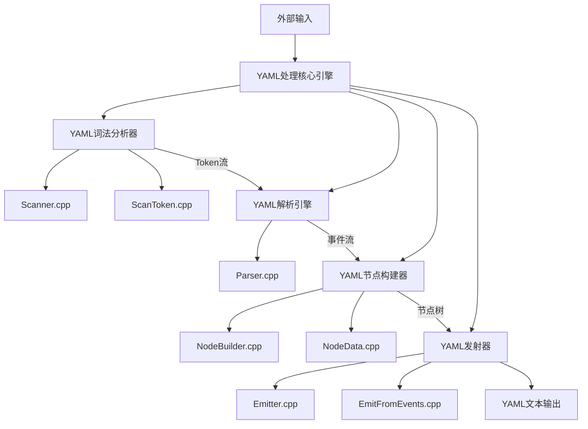
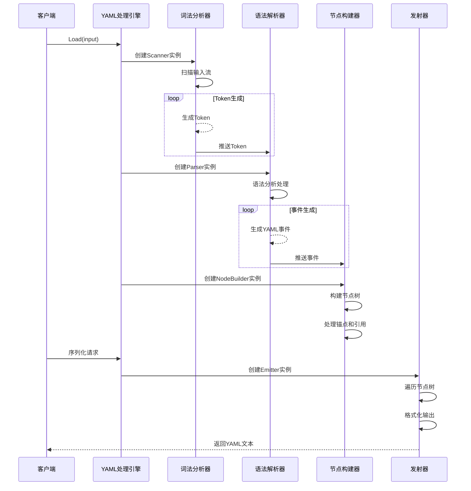

# YAML处理基础设施域技术实现文档

## 1. 概述

YAML处理基础设施域是MultiFormatConfigParser项目中的核心基础设施组件，提供了完整的YAML语言解析和生成能力。该领域基于yaml-cpp库实现，负责将YAML文本转换为内存中的可操作数据结构，并支持数据的序列化输出，为上层YAML配置解析器提供技术支撑。

## 2. 架构设计

### 2.1 整体架构

YAML处理基础设施域采用分层事件驱动架构，由四个核心模块组成：



### 2.2 核心模块职责

| 模块名称 | 主要职责 | 关键文件 |
|---------|---------|---------|
| YAML词法分析器 | 将YAML文本分解为语法单元(Token) | scanner.cpp, scantoken.cpp |
| YAML解析引擎 | 基于Token流进行语法分析，生成事件流 | parser.cpp, singledocparser.cpp |
| YAML节点构建器 | 接收事件流，构建内存节点树 | nodebuilder.cpp, node_data.cpp |
| YAML发射器 | 将内存节点树序列化为YAML文本 | emitter.cpp, emitfromevents.cpp |

## 3. 技术实现细节

### 3.1 YAML词法分析器

#### 3.1.1 实现原理
YAML词法分析器基于有限状态自动机(FSM)实现，通过Scanner类维护以下关键状态：
- 缩进栈：管理YAML的缩进层次结构
- 简单键上下文：处理YAML中的简单键值对
- 流程状态：控制词法分析流程
- Token队列：缓存生成的Token

#### 3.1.2 核心功能
- **Token生成**：通过`ScanNextToken()`方法将输入流转换为Token序列
- **状态管理**：维护`m_simpleKeyAllowed`、`m_scalarValueAllowed`、`m_canBeJSONFlow`等状态变量
- **延迟扫描**：采用延迟扫描策略，仅在需要时生成Token

#### 3.1.3 关键代码结构
```cpp
class Scanner {
private:
    Stream INPUT;              // 输入流
    std::queue<Token> m_tokens; // Token队列
    bool m_startedStream;      // 流开始标志
    bool m_endedStream;        // 流结束标志
    bool m_simpleKeyAllowed;   // 简单键允许标志
    bool m_scalarValueAllowed; // 标量值允许标志
    bool m_canBeJSONFlow;      // JSON流格式标志
    std::vector<SimpleKey> m_simpleKeys; // 简单键栈
    std::vector<int> m_indents;         // 缩进栈
    // ... 其他成员
};
```

### 3.2 YAML解析引擎

#### 3.2.1 实现原理
YAML解析引擎采用递归下降的解析策略，严格遵循YAML 1.2规范。主要由Parser类和SingleDocParser类协同工作：
- **Parser类**：负责指令处理和文档级别解析
- **SingleDocParser类**：负责单个YAML文档的详细解析

#### 3.2.2 核心功能
- **指令处理**：解析YAML指令，如`%YAML`和`%TAG`
- **文档解析**：通过`HandleNextDocument()`方法处理YAML文档
- **事件生成**：将解析结果转换为事件流，供节点构建器消费

#### 3.2.3 关键代码结构
```cpp
class Parser {
private:
    std::unique_ptr<Scanner> m_pScanner;     // 词法分析器
    std::unique_ptr<Directives> m_pDirectives; // 指令处理器
    
public:
    bool HandleNextDocument(EventHandler& eventHandler);
    void ParseDirectives();
    // ... 其他方法
};
```

### 3.3 YAML节点构建器

#### 3.3.1 实现原理
YAML节点构建器采用访客模式(Visitor Pattern)，通过NodeBuilder类监听解析事件，动态构建节点树。该模块使用内存池优化节点分配，提高性能。

#### 3.3.2 核心功能
- **节点树构建**：通过`Push()`和`Pop()`方法维护节点栈，构建层次结构
- **锚点处理**：支持YAML锚点和别名引用机制
- **内存管理**：通过`shared_memory_holder`统一管理节点内存

#### 3.3.3 关键代码结构
```cpp
class NodeBuilder {
private:
    std::shared_ptr<detail::memory_holder> m_pMemory; // 内存管理器
    detail::node* m_pRoot;                             // 根节点
    std::vector<detail::node*> m_stack;               // 节点栈
    std::vector<detail::node*> m_anchors;             // 锚点表
    std::vector<PushedKey> m_keys;                    // 键值对
    unsigned int m_mapDepth;                           // 映射深度
    
public:
    void OnScalar(const Mark& mark, const std::string& tag, 
                  anchor_t anchor, const std::string& value);
    void OnSequenceStart(const Mark& mark, const std::string& tag, 
                         anchor_t anchor, EmitterStyle::value style);
    void OnMapStart(const Mark& mark, const std::string& tag, 
                    anchor_t anchor, EmitterStyle::value style);
    // ... 其他事件处理方法
};
```

### 3.4 YAML发射器

#### 3.4.1 实现原理
YAML发射器基于状态模式管理输出过程，支持流式和块式两种发射风格。Emitter类维护全局和局部格式设置，确保输出符合YAML规范。

#### 3.4.2 核心功能
- **序列化输出**：将内存节点树转换为YAML文本
- **格式化处理**：支持不同的输出格式和样式
- **事件驱动转换**：通过EmitFromEvents类将节点事件转换为发射操作

#### 3.4.3 关键代码结构
```cpp
class Emitter {
private:
    std::unique_ptr<EmitterState> m_pState; // 发射状态
    ostream_wrapper m_stream;                // 输出流
    
public:
    // 全局设置方法
    bool SetOutputCharset(EMITTER_MANIP value);
    bool SetStringFormat(EMITTER_MANIP value);
    bool SetSeqFormat(EMITTER_MANIP value);
    bool SetMapFormat(EMITTER_MANIP value);
    // ... 其他设置方法
};

class EmitFromEvents {
private:
    Emitter& m_emitter;              // 发射器引用
    std::stack<State> m_stateStack;  // 状态栈
    
public:
    void OnScalar(const Mark&, const std::string& tag, 
                  anchor_t anchor, const std::string& value);
    void OnSequenceStart(const Mark&, const std::string& tag, 
                         anchor_t anchor, EmitterStyle::value style);
    void OnMapStart(const Mark&, const std::string& tag, 
                    anchor_t anchor, EmitterStyle::value style);
    // ... 其他事件处理方法
};
```

## 4. 数据流程与交互

### 4.1 YAML文档解析流程



### 4.2 核心数据结构

#### 4.2.1 Token结构
Token是词法分析的基本单元，包含类型、值、位置和参数等信息：
```cpp
struct Token {
    enum STATUS { VALID, INVALID, UNVERIFIED };
    enum TYPE { DOC_START, DOC_END, DIRECTIVE, // ... 其他类型 };
    
    TYPE type;
    STATUS status;
    Mark mark;
    std::string value;
    std::vector<std::string> params;
};
```

#### 4.2.2 Node结构
Node是YAML文档的内存表示，支持标量、序列和映射三种类型：
```cpp
namespace detail {
    class node {
    private:
        NodeType::value m_type;
        std::string m_tag;
        EmitterStyle::value m_style;
        std::string m_scalar;
        std::vector<node*> m_sequence;
        std::map<node*, node*, less> m_map;
        // ... 其他成员
    };
}
```

## 5. 技术特性与优势

### 5.1 核心特性

1. **完整的YAML 1.2规范支持**
   - 支持多文档处理
   - 支持锚点和别名引用
   - 支持标签和指令处理
   - 支持流式和块式两种风格

2. **高性能实现**
   - 延迟扫描策略，按需生成Token
   - 内存池管理，减少内存分配开销
   - 事件驱动架构，提高处理效率

3. **健壮的错误处理**
   - 完整的异常处理机制
   - 详细的错误信息报告
   - 语法验证和错误恢复

4. **灵活的扩展性**
   - 模块化设计，易于扩展
   - 清晰的接口定义
   - 支持自定义事件处理器

### 5.2 设计优势

1. **分层架构**
   - 清晰的职责分离
   - 低耦合高内聚
   - 易于维护和测试

2. **事件驱动模式**
   - 松散的组件耦合
   - 灵活的处理流程
   - 支持多种处理策略

3. **内存管理优化**
   - 智能指针控制生命周期
   - 统一的内存分配策略
   - 高效的内存使用

4. **标准遵循**
   - 严格遵循YAML 1.2规范
   - 兼容主流YAML文档
   - 支持标准YAML特性

## 6. 性能优化策略

### 6.1 词法分析优化

- **延迟扫描**：仅在需要时生成Token，减少不必要的处理
- **状态缓存**：维护词法分析状态，避免重复计算
- **批量处理**：对连续的相同类型Token进行批量处理

### 6.2 节点构建优化

- **内存池**：使用内存池技术减少内存分配开销
- **节点复用**：对相同值的节点进行复用
- **延迟构建**：仅在需要时构建复杂节点结构

### 6.3 序列化优化

- **流式输出**：支持流式输出，减少内存占用
- **格式缓存**：缓存格式化结果，避免重复计算
- **批量写入**：对输出进行缓冲，减少I/O操作

## 7. 错误处理机制

### 7.1 异常类型

```cpp
namespace YAML {
    class Exception : public std::runtime_error {
        // 基础异常类
    };
    
    class ParserException : public Exception {
        // 解析异常
    };
    
    class BadFile : public Exception {
        // 文件异常
    };
    
    // ... 其他异常类型
}
```

### 7.2 错误恢复

- **词法级恢复**：在词法分析阶段进行错误恢复
- **语法级恢复**：在语法分析阶段尝试继续解析
- **语义级恢复**：在语义处理阶段提供默认值

## 8. 使用示例

### 8.1 基本解析示例

```cpp
#include <yaml-cpp/yaml.h>
#include <iostream>

int main() {
    // 从字符串解析YAML
    std::string yaml_str = R"(
name: John Doe
age: 30
address:
  street: 123 Main St
  city: Anytown
)";
    
    try {
        YAML::Node node = YAML::Load(yaml_str);
        
        // 访问标量值
        std::string name = node["name"].as<std::string>();
        int age = node["age"].as<int>();
        
        // 访问嵌套结构
        std::string street = node["address"]["street"].as<std::string>();
        
        std::cout << "Name: " << name << std::endl;
        std::cout << "Age: " << age << std::endl;
        std::cout << "Street: " << street << std::endl;
        
    } catch (const YAML::Exception& e) {
        std::cerr << "YAML Error: " << e.what() << std::endl;
    }
    
    return 0;
}
```

### 8.2 序列化示例

```cpp
#include <yaml-cpp/yaml.h>
#include <fstream>

int main() {
    // 创建YAML节点
    YAML::Node node;
    node["name"] = "Jane Doe";
    node["age"] = 28;
    node["skills"] = YAML::Node(YAML::NodeType::Sequence);
    node["skills"].push_back("C++");
    node["skills"].push_back("Python");
    
    // 序列化到文件
    std::ofstream fout("output.yaml");
    fout << node;
    
    // 序列化到字符串
    std::string yaml_str = YAML::Dump(node);
    std::cout << yaml_str << std::endl;
    
    return 0;
}
```

## 9. 总结与展望

### 9.1 技术总结

YAML处理基础设施域作为MultiFormatConfigParser项目的核心组件，提供了完整的YAML语言处理能力。通过分层事件驱动架构，实现了从YAML文本到内存节点树的双向转换，为上层应用提供了强大而灵活的YAML处理支持。

### 9.2 技术优势

- **完整的功能支持**：全面支持YAML 1.2规范
- **优秀的性能表现**：多种优化策略确保高效处理
- **健壮的错误处理**：完善的异常处理和错误恢复机制
- **灵活的扩展能力**：模块化设计支持功能扩展

### 9.3 未来发展方向

1. **性能优化**：进一步优化大文件处理性能
2. **功能增强**：支持更多YAML高级特性
3. **内存优化**：减少内存占用，提高内存使用效率
4. **API改进**：提供更简洁易用的API接口

YAML处理基础设施域为项目提供了坚实的技术基础，其优秀的设计和实现为整个系统的稳定性和可靠性提供了重要保障。