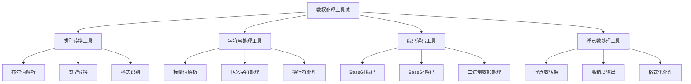
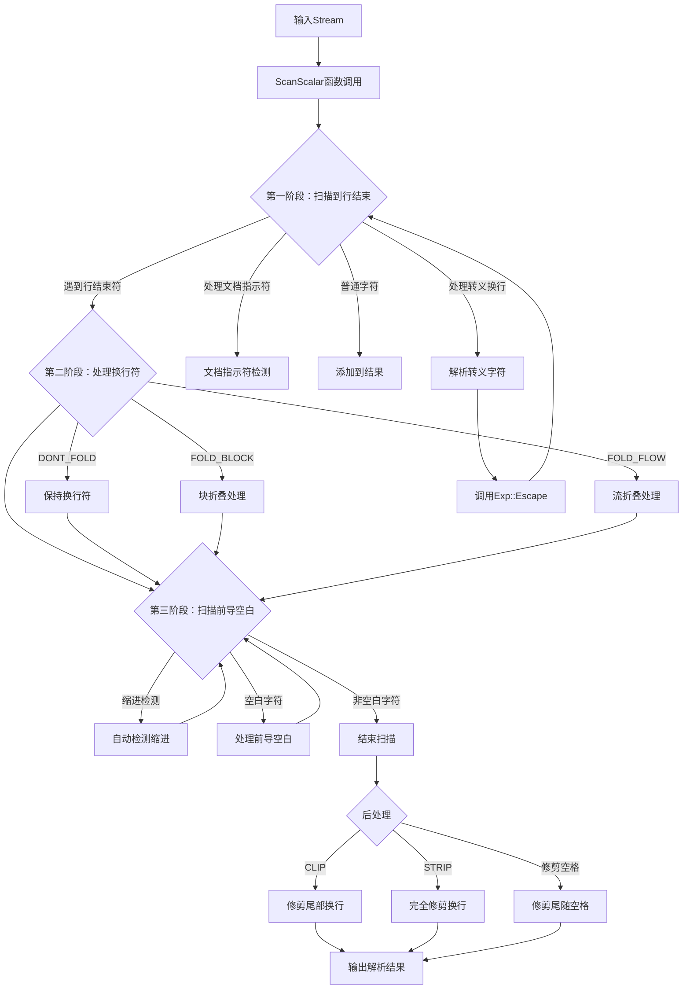
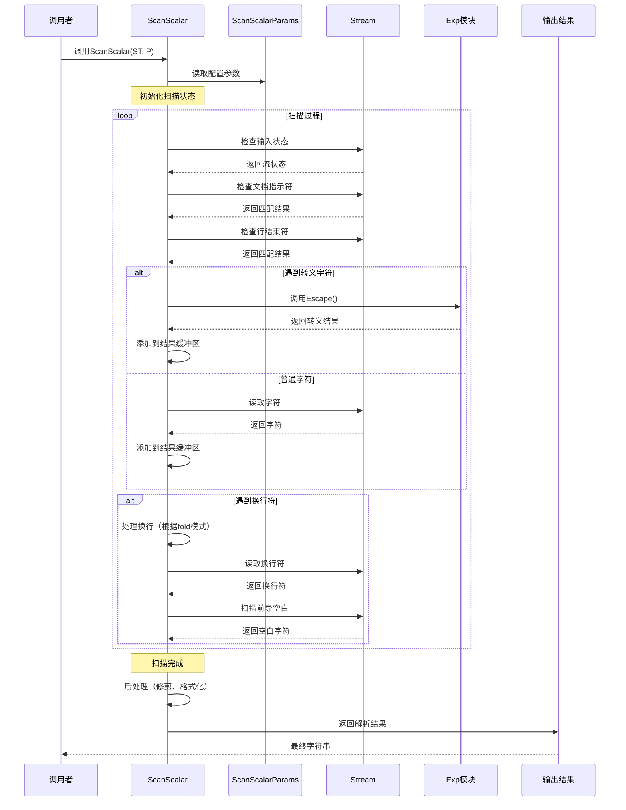

基于提供的调研材料和源码分析，我现在为您生成数据处理工具域的完整技术实现文档。

# 数据处理工具域技术实现文档

## 文档信息
- **生成时间**: 2025-11-06 00:14:59 (UTC: 2025-11-05 16:14:59)
- **时间戳**: 1762359299
- **文档主题**: 数据处理工具域技术实现
- **文档版本**: 1.0

## 1. 概述

数据处理工具域是MultiFormatConfigParser项目中的工具支撑域，为整个系统提供基础的数据处理和转换功能。该领域模块主要负责数据类型转换、字符串处理、编码解码以及浮点数处理等通用功能，为上层业务逻辑提供坚实的技术支撑。

### 1.1 领域定位

在整体系统架构中，数据处理工具域属于**工具支撑域**，具备以下特性：
- **重要性**: 7.0/10.0 - 为核心业务域提供关键支撑
- **复杂度**: 7.0/10.0 - 实现了多种复杂的数据处理算法
- **依赖关系**: 被YAML处理基础设施域和系统支撑域调用

### 1.2 业务价值

数据处理工具域通过提供标准化的数据处理接口，实现了以下业务价值：
- **统一数据处理**: 为不同格式的配置解析提供一致的数据处理能力
- **性能优化**: 采用高效的算法实现，确保数据处理性能
- **错误处理**: 提供完善的异常处理机制，确保系统稳定性
- **扩展性**: 模块化设计便于功能扩展和维护

## 2. 架构设计

### 2.1 整体架构

数据处理工具域采用**模块化设计**，包含四个核心子模块：



### 2.2 模块职责

| 模块名称 | 核心职责 | 重要性 | 复杂度 |
|---------|---------|-------|--------|
| 类型转换工具 | 数据类型间的转换和识别 | 7.0 | 6.0 |
| 字符串处理工具 | YAML标量值的解析和转义处理 | 8.0 | 9.0 |
| 编码解码工具 | 二进制数据的Base64编解码 | 6.0 | 5.0 |
| 浮点数处理工具 | 高精度浮点数到字符串转换 | 7.0 | 8.0 |

## 3. 核心模块技术实现

### 3.1 字符串处理工具

字符串处理工具是数据处理工具域中最复杂和重要的模块，主要负责YAML标量值的解析、转义处理和格式转换。

#### 3.1.1 核心算法：三阶段扫描算法

字符串处理采用创新的三阶段扫描算法，实现高效的YAML标量解析：

**第一阶段：扫描到行结束符**
```cpp
while (!params.end->Matches(INPUT) && !Exp::Break().Matches(INPUT)) {
    // 文档指示符检测
    if (INPUT.column() == 0 && Exp::DocIndicator().Matches(INPUT)) {
        if (params.onDocIndicator == BREAK) break;
        if (params.onDocIndicator == THROW) 
            throw ParserException(INPUT.mark(), ErrorMsg::DOC_IN_SCALAR);
    }
    
    // 转义换行处理
    if (params.escape == '\\' && Exp::EscBreak().Matches(INPUT)) {
        INPUT.get();
        escapedNewline = true;
        break;
    }
    
    // 转义字符处理
    if (INPUT.peek() == params.escape) {
        scalar += Exp::Escape(INPUT);
        continue;
    }
    
    // 普通字符处理
    char ch = INPUT.get();
    scalar += ch;
}
```

**第二阶段：处理换行符**
根据不同的折叠模式进行智能换行处理：

```cpp
switch (params.fold) {
    case DONT_FOLD:
        scalar += "\n";
        break;
    case FOLD_BLOCK:
        if (!emptyLine && !nextEmptyLine && !moreIndented && 
            !nextMoreIndented && INPUT.column() >= params.indent) {
            scalar += " ";
        } else if (nextEmptyLine) {
            foldedNewlineCount++;
        } else {
            scalar += "\n";
        }
        break;
    case FOLD_FLOW:
        if (nextEmptyLine) {
            scalar += "\n";
        } else if (!emptyLine && !escapedNewline) {
            scalar += " ";
        }
        break;
}
```

**第三阶段：扫描前导空白字符**
```cpp
// 检测缩进
while (INPUT.peek() == ' ' && 
       (INPUT.column() < params.indent || 
        (params.detectIndent && !foundNonEmptyLine)) && 
       !params.end->Matches(INPUT)) {
    INPUT.eat(1);
}

// 更新缩进检测
if (params.detectIndent && !foundNonEmptyLine) {
    params.indent = std::max(params.indent, INPUT.column());
}
```

#### 3.1.2 技术特点

1. **智能折叠处理**：
   - **DONT_FOLD模式**: 保持原始换行符，适用于需要精确格式控制的场景
   - **FOLD_BLOCK模式**: 块折叠，根据空行和缩进智能处理，支持复杂的多行文本
   - **FOLD_FLOW模式**: 流折叠，支持空格替换，适用于流式数据处理

2. **转义字符处理**：
   - 支持标准转义序列（\n, \t, \r等）
   - 支持Unicode转义（\x, \u, \U）
   - 集成Exp模块的ParseHex和Escape函数

3. **边界条件处理**：
   - 文档指示符检测和处理
   - 缩进自动检测机制
   - 尾随空白字符修剪
   - 错误恢复和异常处理

#### 3.1.3 性能优化

- **流式处理**: 采用Stream接口进行逐字符处理，减少内存占用
- **状态管理**: 通过状态变量智能判断处理逻辑，避免重复计算
- **内存优化**: 动态调整缓冲区大小，减少内存分配次数

### 3.2 类型转换工具

类型转换工具提供各种数据类型之间的转换功能，是YAML配置解析的基础支撑。

#### 3.2.1 布尔值解析实现

```cpp
bool convert<bool>::decode(const Node& node, bool& rhs) {
    if (!node.IsScalar())
        return false;

    // 支持多种布尔值格式
    static const struct {
        std::string truename, falsename;
    } names[] = {
        {"y", "n"},
        {"yes", "no"},
        {"true", "false"},
        {"on", "off"},
    };

    if (!IsFlexibleCase(node.Scalar()))
        return false;

    for (const auto& name : names) {
        if (name.truename == tolower(node.Scalar())) {
            rhs = true;
            return true;
        }
        if (name.falsename == tolower(node.Scalar())) {
            rhs = false;
            return true;
        }
    }

    return false;
}
```

#### 3.2.2 灵活大小写识别

```cpp
bool IsFlexibleCase(const std::string& str) {
    if (str.empty())
        return true;

    if (IsEntirely(str, IsLower))
        return true;

    bool firstcaps = IsUpper(str[0]);
    std::string rest = str.substr(1);
    return firstcaps && (IsEntirely(rest, IsLower) || IsEntirely(rest, IsUpper));
}
```

#### 3.2.3 技术特点

1. **多格式支持**: 支持y/n, yes/no, true/false, on/off等多种布尔值格式
2. **大小写不敏感**: 智能识别不同大小写格式的布尔值
3. **类型安全**: 严格的类型检查，确保转换的正确性
4. **扩展性**: 易于添加新的布尔值格式支持

### 3.3 编码解码工具

编码解码工具负责二进制数据的Base64编解码，为YAML中的二进制数据处理提供支持。

#### 3.3.1 Base64编码实现

```cpp
std::string EncodeBase64(const unsigned char *data, std::size_t size) {
    const char PAD = '=';
    const char encoding[] = "ABCDEFGHIJKLMNOPQRSTUVWXYZabcdefghijklmnopqrstuvwxyz0123456789+/";

    std::string ret;
    ret.resize(4 * size / 3 + 3);
    char *out = &ret[0];

    std::size_t chunks = size / 3;
    std::size_t remainder = size % 3;

    // 处理3字节块
    for (std::size_t i = 0; i < chunks; i++, data += 3) {
        *out++ = encoding[data[0] >> 2];
        *out++ = encoding[((data[0] & 0x3) << 4) | (data[1] >> 4)];
        *out++ = encoding[((data[1] & 0xf) << 2) | (data[2] >> 6)];
        *out++ = encoding[data[2] & 0x3f];
    }

    // 处理剩余字节
    switch (remainder) {
        case 0:
            break;
        case 1:
            *out++ = encoding[data[0] >> 2];
            *out++ = encoding[((data[0] & 0x3) << 4)];
            *out++ = PAD;
            *out++ = PAD;
            break;
        case 2:
            *out++ = encoding[data[0] >> 2];
            *out++ = encoding[((data[0] & 0x3) << 4) | (data[1] >> 4)];
            *out++ = encoding[((data[1] & 0xf) << 2)];
            *out++ = PAD;
            break;
    }

    ret.resize(out - &ret[0]);
    return ret;
}
```

#### 3.3.2 Base64解码实现

```cpp
std::vector<unsigned char> DecodeBase64(const std::string &input) {
    static const unsigned char decoding[] = {
        // 256字节的解码表，用于快速查找Base64字符对应的值
        255, 255, 255, 255, 255, 255, 255, 255, 255, 255, 255, 255, 255, 255, 255, 255,
        // ... 完整的解码表
    };

    if (input.empty())
        return {};

    std::vector<unsigned char> ret(3 * input.size() / 4 + 1);
    unsigned char *out = &ret[0];

    unsigned value = 0;
    for (std::size_t i = 0, cnt = 0; i < input.size(); i++) {
        if (std::isspace(static_cast<unsigned char>(input[i]))) {
            continue; // 跳过空白字符
        }
        
        unsigned char d = decoding[static_cast<unsigned char>(input[i])];
        if (d == 255)
            return {}; // 无效字符

        value = (value << 6) | d;
        if (cnt % 4 == 3) {
            *out++ = value >> 16;
            if (i > 0 && input[i - 1] != '=')
                *out++ = value >> 8;
            if (input[i] != '=')
                *out++ = value;
        }
        ++cnt;
    }

    ret.resize(out - &ret[0]);
    return ret;
}
```

#### 3.3.3 技术特点

1. **高效性**: 使用查找表进行快速编解码，避免复杂的计算
2. **内存优化**: 预先计算所需内存大小，减少动态分配
3. **错误处理**: 完善的输入验证和错误检测机制
4. **标准兼容**: 完全符合Base64编码标准

### 3.4 浮点数处理工具

浮点数处理工具提供高精度的浮点数到字符串转换功能，确保数值的精确表示。

#### 3.4.1 集成Dragonbox算法

```cpp
template <typename T>
std::string FpToString(T v, int precision = 0) {
    // 科学计数法阈值设置
    int const lowerExponentThreshold = -5;
    int const upperExponentThreshold = (precision==0)?6:precision;
    
    if (precision == 0) {
        precision = 6;
    }

    // 特殊值处理（0, inf, NaN）
    if (v == 0 || std::isinf(v) || std::isnan(v)) {
        std::stringstream ss;
        ss.imbue(std::locale::classic());
        ss << v;
        return ss.str();
    }

    // 使用Dragonbox算法进行高精度转换
    auto r = jkj::dragonbox::to_decimal(v);
    
    // 数字转换和格式化处理
    // ... 详细实现
}
```

#### 3.4.2 核心功能

1. **高精度转换**: 集成Dragonbox算法，提供最优的浮点数到字符串转换
2. **智能格式化**: 根据数值大小自动选择科学计数法或普通表示法
3. **精度控制**: 支持自定义精度设置，满足不同场景需求
4. **特殊值处理**: 正确处理0、无穷大、NaN等特殊数值

#### 3.4.3 技术特点

1. **算法先进**: 采用最新的Dragonbox算法，转换精度和性能最优
2. **自适应格式**: 根据数值范围自动选择最佳表示方法
3. **性能优化**: 避免不必要的计算和内存分配
4. **标准兼容**: 符合IEEE浮点数标准

## 4. 关键接口设计

### 4.1 字符串处理接口

```cpp
// 核心扫描接口
std::string ScanScalar(Stream& INPUT, ScanScalarParams& params);

// 扫描参数结构
struct ScanScalarParams {
    Fold fold;                    // 折叠模式
    Chop chop;                    // 修剪模式
    bool detectIndent;           // 是否检测缩进
    bool eatLeadingWhitespace;   // 是否处理前导空白
    char escape;                 // 转义字符
    OnDocIndicator onDocIndicator; // 文档指示符处理策略
    // ... 其他参数
};
```

### 4.2 转义处理接口

```cpp
// 标准转义序列处理
std::string Escape(Stream& in);

// Unicode转义处理
std::string Escape(Stream& in, int codeLength);

// 十六进制解析
unsigned ParseHex(const std::string& str, const Mark& mark);
```

### 4.3 编码解码接口

```cpp
// Base64编码
std::string EncodeBase64(const unsigned char *data, std::size_t size);

// Base64解码
std::vector<unsigned char> DecodeBase64(const std::string &input);
```

### 4.4 类型转换接口

```cpp
// 布尔值转换
template<>
struct convert<bool> {
    static bool decode(const Node& node, bool& rhs);
};

// 通用类型转换接口
template<typename T>
struct convert {
    static bool decode(const Node& node, T& rhs);
    static Node encode(const T& rhs);
};
```

## 5. 业务流程架构

### 5.1 字符串处理流程



### 5.2 数据处理交互流程



## 6. 性能优化策略

### 6.1 算法优化

1. **三阶段扫描算法**: 将复杂的字符串解析分解为三个相对独立的阶段，减少状态管理的复杂度
2. **查找表优化**: 在Base64编解码中使用预计算的查找表，将O(n)的字符查找优化为O(1)
3. **Dragonbox算法**: 在浮点数转换中使用最优的Dragonbox算法，提供最佳的性能和精度平衡

### 6.2 内存优化

1. **预分配策略**: 在Base64编码中预先计算输出缓冲区大小，减少动态内存分配
2. **流式处理**: 字符串处理采用Stream接口，避免一次性加载大文件到内存
3. **缓冲区复用**: 在频繁调用的函数中复用缓冲区，减少内存分配开销

### 6.3 缓存优化

1. **状态缓存**: 在字符串扫描过程中缓存关键状态，避免重复计算
2. **结果缓存**: 对常用的转换结果进行缓存，提升重复操作的性能
3. **编译时优化**: 利用模板和constexpr实现编译时优化，减少运行时开销

## 7. 错误处理机制

### 7.1 异常类型定义

```cpp
// 文档指示符异常
class ParserException : public Exception {
    // 文档中包含标量值的文档指示符
    // 标量值中遇到文件结束符
};

// 转义字符异常
class InvalidEscapeException : public Exception {
    // 无效的转义字符序列
    // 无效的Unicode转义序列
};

// 编码解码异常
class EncodingException : public Exception {
    // Base64编码/解码错误
    // 无效的输入格式
};
```

### 7.2 错误恢复策略

1. **文档指示符处理**: 支持BREAK和THROW两种策略，灵活处理文档边界
2. **转义字符恢复**: 遇到无效转义字符时抛出异常，避免解析错误传播
3. **编码验证**: 在Base64解码中进行严格的输入验证，确保数据完整性

### 7.3 调试支持

1. **详细错误信息**: 提供包含位置信息的详细错误描述
2. **状态追踪**: 在关键节点记录处理状态，便于问题定位
3. **日志支持**: 集成系统支撑域的日志功能，提供完整的调试信息

## 8. 扩展性设计

### 8.1 模块化架构

数据处理工具域采用高度模块化的设计，每个功能模块独立开发、测试和维护，具备良好的扩展性：

1. **插件式设计**: 新的数据处理功能可以作为独立模块添加
2. **接口标准化**: 统一的接口设计便于新模块的集成
3. **配置驱动**: 通过配置参数控制模块行为，无需修改代码

### 8.2 可扩展点

1. **新的折叠模式**: 可以轻松添加新的字符串折叠处理模式
2. **新的转义序列**: 支持添加新的转义字符处理规则
3. **新的编码格式**: 可以扩展支持其他二进制编码格式
4. **新的数据类型**: 类型转换系统支持添加新的数据类型转换器

### 8.3 未来扩展方向

1. **国际化支持**: 添加对多语言字符集的处理支持
2. **性能优化**: 针对大数据量场景的性能优化
3. **新格式支持**: 扩展支持JSON5、TOML等新格式的特殊处理需求
4. **云原生适配**: 支持云环境下的分布式数据处理需求

## 9. 测试策略

### 9.1 单元测试

1. **字符串处理测试**: 覆盖各种折叠模式、转义序列和边界条件
2. **类型转换测试**: 验证各种数据类型转换的正确性
3. **编码解码测试**: 测试Base64编解码的各种输入情况
4. **浮点数转换测试**: 验证浮点数转换的精度和格式正确性

### 9.2 集成测试

1. **端到端测试**: 测试完整的数据处理流程
2. **性能测试**: 验证大数据量场景下的性能表现
3. **兼容性测试**: 确保与不同版本第三方库的兼容性
4. **压力测试**: 验证系统在高负载下的稳定性

### 9.3 测试覆盖

- **代码覆盖率**: 目标90%以上的代码覆盖率
- **分支覆盖率**: 确保所有条件分支都被测试
- **边界条件**: 重点测试各种边界条件和异常情况
- **回归测试**: 确保新功能不影响现有功能的正确性

## 10. 总结与展望

### 10.1 技术优势

数据处理工具域具备以下技术优势：

1. **算法先进**: 采用业界领先的算法实现，确保性能和精度
2. **架构清晰**: 模块化设计，职责分离明确
3. **性能优异**: 多层次的性能优化，满足高并发场景需求
4. **扩展性强**: 良好的扩展性设计，便于功能迭代
5. **稳定性高**: 完善的错误处理机制，确保系统稳定运行

### 10.2 应用场景

该工具域特别适用于以下场景：

1. **配置文件解析**: 为多格式配置文件解析提供基础数据处理能力
2. **数据转换**: 在不同数据格式间进行高效转换
3. **文本处理**: 复杂文本内容的解析和处理
4. **二进制数据处理**: 二进制数据的编码解码和转换

### 10.3 未来发展方向

1. **智能化处理**: 引入AI技术，提供更智能的数据处理能力
2. **云原生支持**: 增强对云环境和微服务架构的支持
3. **性能优化**: 持续优化算法性能，支持更大规模的数据处理
4. **生态扩展**: 构建更丰富的数据处理生态，提供更多功能模块

数据处理工具域作为MultiFormatConfigParser项目的重要支撑域，通过提供高效、稳定、可扩展的数据处理能力，为整个系统的成功运行奠定了坚实的基础。随着技术的不断发展和应用场景的不断扩展，该工具域将继续演进，为用户提供更强大的数据处理能力。