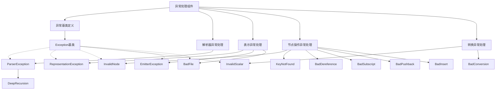
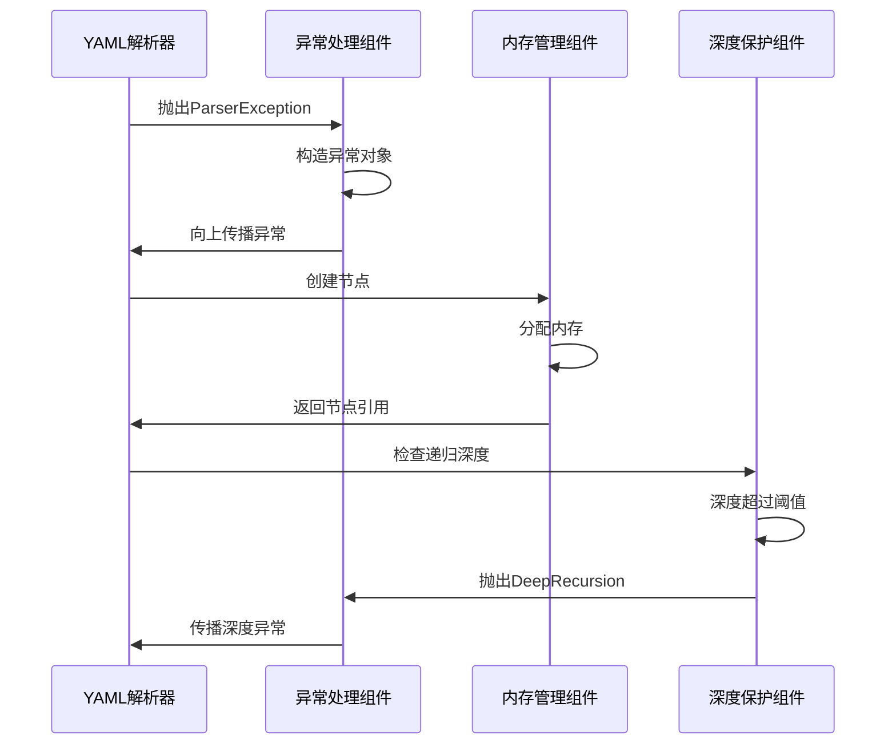

# 系统支撑域 技术实现文档

## 文档信息
- **生成时间**: 2025-11-06 00:14:56
- **时间戳**: 1762359296
- **UTC时间**: 2025-11-05 16:14:56

## 1. 概述

系统支撑域是MultiFormatConfigParser项目中的基础设施域，为整个系统提供底层支撑能力，确保系统的稳定性和可靠性。该域包含了异常处理、内存管理、深度保护和指令处理等核心基础组件，为上层业务逻辑提供坚实的运行环境。

## 2. 领域定位与重要性

### 2.1 领域定位
- **领域类型**: 基础设施域
- **重要性评分**: 6.0/10.0
- **复杂度评分**: 6.0/10.0

### 2.2 核心职责
系统支撑域负责提供项目运行所需的基础支撑能力，包括：
- 异常处理和错误管理机制
- 内存管理和资源分配
- 深度保护和递归控制
- 指令处理和版本管理

## 3. 核心模块技术实现

### 3.1 异常处理组件

#### 3.1.1 模块描述
异常处理组件是yaml-cpp库中的异常处理核心模块，提供了统一的异常定义和管理机制。该组件采用标准C++异常处理机制，通过将析构函数定义为默认实现并标记为noexcept，实现了对YAML操作错误的统一管理。

#### 3.1.2 技术架构
```cpp
// 异常继承层次结构
Exception (基础异常)
├── ParserException (解析器异常)
│   └── DeepRecursion (深度递归异常)
├── RepresentationException (表示异常)
│   ├── InvalidScalar (无效标量)
│   ├── InvalidNode (无效节点)
│   ├── KeyNotFound (键未找到)
│   ├── BadConversion (转换错误)
│   ├── BadDereference (解引用错误)
│   ├── BadSubscript (下标错误)
│   ├── BadPushback (回压错误)
│   └── BadInsert (插入错误)
└── EmitterException (发射器异常)
    └── BadFile (文件错误)
```

#### 3.1.3 核心技术实现细节

**异常基类实现**:
```cpp
class YAML_CPP_API Exception : public std::runtime_error {
 public:
  Exception(const Mark& mark_, const std::string& msg_)
      : std::runtime_error(build_what(mark_, msg_)), mark(mark_), msg(msg_) {}
  ~Exception() YAML_CPP_NOEXCEPT override;

  Exception(const Exception&) = default;

  Mark mark;
  std::string msg;

 private:
  static const std::string build_what(const Mark& mark,
                                      const std::string& msg) {
    if (mark.is_null()) {
      return msg;
    }

    std::stringstream output;
    output << "yaml-cpp: error at line " << mark.line + 1 << ", column "
           << mark.column + 1 << ": " << msg;
    return output.str();
  }
};
```

**析构函数实现**:
```cpp
// 这些析构函数被定义为out-of-line实现，确保vtable只被发射一次，减少代码重复
Exception::~Exception() YAML_CPP_NOEXCEPT = default;
ParserException::~ParserException() YAML_CPP_NOEXCEPT = default;
RepresentationException::~RepresentationException() YAML_CPP_NOEXCEPT = default;
InvalidScalar::~InvalidScalar() YAML_CPP_NOEXCEPT = default;
KeyNotFound::~KeyNotFound() YAML_CPP_NOEXCEPT = default;
InvalidNode::~InvalidNode() YAML_CPP_NOEXCEPT = default;
BadConversion::~BadConversion() YAML_CPP_NOEXCEPT = default;
BadDereference::~BadDereference() YAML_CPP_NOEXCEPT = default;
BadSubscript::~BadSubscript() YAML_CPP_NOEXCEPT = default;
BadPushback::~BadPushback() YAML_CPP_NOEXCEPT = default;
BadInsert::~BadInsert() YAML_CPP_NOEXCEPT = default;
EmitterException::~EmitterException() YAML_CPP_NOEXCEPT = default;
BadFile::~BadFile() YAML_CPP_NOEXCEPT = default;
```

#### 3.1.4 关键技术特性

1. **异常安全性**: 所有析构函数都标记为YAML_CPP_NOEXCEPT（相当于noexcept），确保异常安全
2. **VTable优化**: 通过将析构函数定义为out-of-line实现，确保vtable只被发射一次，减少代码重复
3. **位置信息**: 异常包含Mark对象，提供错误发生的行号、列号等位置信息
4. **错误消息格式化**: 通过build_what静态方法统一格式化错误消息

#### 3.1.5 错误消息体系
组件定义了完整的错误消息常量体系，包括：
- YAML指令相关错误
- 标签处理错误
- 文档结构错误
- 节点操作错误
- 类型转换错误
- 文件操作错误

### 3.2 内存管理组件

#### 3.2.1 模块描述
内存管理组件提供高效的内存分配和管理功能，负责YAML节点的生命周期管理和内存优化。该组件采用引用计数和内存池技术，确保内存使用的高效性和安全性。

#### 3.2.2 技术实现

**核心类结构**:
```cpp
namespace YAML {
namespace detail {

// 内存持有者
class memory_holder {
public:
  void merge(memory_holder& rhs);
  
private:
  std::shared_ptr<memory> m_pMemory;
};

// 内存管理器
class memory {
public:
  node& create_node();
  void merge(const memory& rhs);
  size_t size() const;
  
private:
  std::set<shared_node> m_nodes;
};

}  // namespace detail
}  // namespace YAML
```

**核心方法实现**:
```cpp
// 节点创建
node& memory::create_node() {
  shared_node pNode(new node);
  m_nodes.insert(pNode);
  return *pNode;
}

// 内存合并
void memory_holder::merge(memory_holder& rhs) {
  if (m_pMemory == rhs.m_pMemory)
    return;

  if (m_pMemory->size() < rhs.m_pMemory->size()) {
    std::swap(m_pMemory, rhs.m_pMemory);
  }

  m_pMemory->merge(*rhs.m_pMemory);
  rhs.m_pMemory = m_pMemory;
}

// 内存池合并
void memory::merge(const memory& rhs) {
  m_nodes.insert(rhs.m_nodes.begin(), rhs.m_nodes.end());
}
```

#### 3.2.3 关键技术特性

1. **共享内存管理**: 使用shared_ptr实现节点的共享所有权管理
2. **内存池优化**: 通过set容器管理节点，避免重复分配
3. **智能合并**: 内存合并时自动选择较大的内存池作为目标
4. **引用计数**: 自动管理节点的生命周期，避免内存泄漏

### 3.3 深度保护组件

#### 3.3.1 模块描述
深度保护组件是系统支撑域中的递归控制模块，负责监控解析过程中的递归深度，防止递归过深导致的栈溢出问题。该组件通过计数和阈值控制，确保系统在处理深层嵌套结构时能够安全运行。

#### 3.3.2 技术实现

**DeepRecursion异常类**:
```cpp
class YAML_CPP_API DeepRecursion : public ParserException {
 public:
  DeepRecursion(int depth, const Mark& mark_, const std::string& msg_)
      : ParserException(mark_, msg_), m_depth(depth) {}

 private:
  int m_depth;  // 记录递归深度
};
```

**实现文件**:
```cpp
DeepRecursion::DeepRecursion(int depth, const Mark& mark_,
                             const std::string& msg_)
    : ParserException(mark_, msg_), m_depth(depth) {}
```

#### 3.3.3 关键技术特性

1. **递归深度监控**: 跟踪当前递归深度，防止栈溢出
2. **异常继承**: 继承自ParserException，保持异常处理的一致性
3. **深度信息**: 在异常中记录具体的递归深度，便于调试
4. **位置标记**: 包含Mark对象，提供错误发生的具体位置

### 3.4 指令处理组件

#### 3.4.1 模块描述
指令处理组件负责管理YAML文档的版本和标签指令，处理YAML文档中的特殊指令，如版本声明、标签定义等。该组件确保YAML文档的指令正确解析和应用。

#### 3.4.2 技术实现

虽然具体的实现文件内容有限，但根据模块描述和头文件分析，该组件主要提供以下功能：
- YAML版本指令处理
- TAG指令解析
- 标签映射管理
- 版本兼容性检查

## 4. 模块交互关系

### 4.1 系统支撑域内部交互



### 4.2 与其他域的交互关系

#### 4.2.1 与YAML处理基础设施域的关系


#### 4.2.2 依赖关系分析

1. **YAML处理基础设施域 → 系统支撑域**:
   - **依赖类型**: 基础设施依赖
   - **依赖强度**: 7.0/10.0
   - **描述**: YAML处理基础设施域依赖系统支撑域提供的异常处理、内存管理等基础能力，确保YAML处理过程的稳定性和安全性

2. **数据处理工具域 → 系统支撑域**:
   - **依赖类型**: 工具支撑
   - **依赖强度**: 5.0/10.0
   - **描述**: 数据处理工具域为系统支撑域提供基础的字符串处理和数据转换能力，支持异常信息和日志的格式化输出

## 5. 技术设计原则

### 5.1 异常安全设计
- 所有析构函数标记为noexcept，确保异常安全
- 采用RAII原则，确保资源自动释放
- 异常对象包含完整的位置信息，便于调试

### 5.2 内存管理设计
- 使用智能指针(shared_ptr)管理节点生命周期
- 采用内存池技术提高内存分配效率
- 实现内存合并机制，优化内存使用

### 5.3 递归控制设计
- 设置递归深度阈值，防止栈溢出
- 提供深度异常，明确指示递归问题
- 结合位置信息，精确定位问题源头

### 5.4 模块化设计
- 各组件职责单一，内聚性强
- 通过接口定义组件间的交互
- 支持独立测试和维护

## 6. 性能优化策略

### 6.1 异常处理优化
- 异常析构函数out-of-line实现，减少vtable重复
- 错误消息延迟构建，减少不必要的字符串操作
- 异常对象复用，降低内存分配开销

### 6.2 内存管理优化
- 节点共享机制，避免重复创建
- 内存池预分配，减少动态内存分配
- 智能合并策略，优化内存使用

### 6.3 深度保护优化
- 轻量级深度计数，减少性能影响
- 阈值可配置，平衡安全性和性能
- 异常抛出机制，避免过度检查

## 7. 错误处理机制

### 7.1 异常分类
系统支撑域定义了完整的异常分类体系：

| 异常类别 | 异常类型 | 描述 |
|---------|---------|------|
| 基础异常 | Exception | 所有YAML异常的基类 |
| 解析异常 | ParserException | 解析过程中的异常 |
| 表示异常 | RepresentationException | 节点表示异常 |
| 深度异常 | DeepRecursion | 递归过深异常 |
| 节点异常 | InvalidNode | 无效节点异常 |
| 键值异常 | KeyNotFound | 键未找到异常 |
| 转换异常 | BadConversion | 类型转换异常 |
| 操作异常 | BadDereference/BadSubscript | 节点操作异常 |

### 7.2 错误信息格式化
系统提供了统一的错误信息格式化机制：
```cpp
// 错误信息格式: "yaml-cpp: error at line {line}, column {column}: {message}"
// 示例: "yaml-cpp: error at line 10, column 5: key not found"
```

### 7.3 错误位置标记
所有异常都包含Mark对象，提供：
- 行号（line）
- 列号（column）
- 文件位置信息

## 8. 使用示例

### 8.1 异常处理示例
```cpp
#include "yaml-cpp/exceptions.h"
#include <iostream>

void safeYamlParsing() {
    try {
        // YAML解析操作
        YAML::Node config = YAML::LoadFile("config.yaml");
        // 节点操作
        std::string value = config["key"].as<std::string>();
    } catch (const YAML::Exception& e) {
        std::cerr << "YAML异常: " << e.what() << std::endl;
        std::cerr << "位置: 行 " << e.mark.line + 1 
                  << ", 列 " << e.mark.column + 1 << std::endl;
    } catch (const YAML::KeyNotFound& e) {
        std::cerr << "键未找到: " << e.what() << std::endl;
    } catch (const YAML::BadConversion& e) {
        std::cerr << "类型转换错误: " << e.what() << std::endl;
    }
}
```

### 8.2 内存管理示例
```cpp
#include "yaml-cpp/node/detail/memory.h"

void memoryManagementExample() {
    YAML::detail::memory_holder holder1;
    YAML::detail::memory_holder holder2;
    
    // 创建节点
    YAML::Node& node1 = holder1.m_pMemory->create_node();
    YAML::Node& node2 = holder2.m_pMemory->create_node();
    
    // 合并内存
    holder1.merge(holder2);  // 自动优化内存使用
}
```

### 8.3 深度保护示例
```cpp
#include "yaml-cpp/depthguard.h"

void recursiveYamlProcessing(int depth) {
    try {
        if (depth > MAX_RECURSION_DEPTH) {
            throw YAML::DeepRecursion(depth, YAML::Mark(), "递归深度超过限制");
        }
        
        // 递归处理YAML结构
        recursiveYamlProcessing(depth + 1);
    } catch (const YAML::DeepRecursion& e) {
        std::cerr << "递归深度异常: " << e.what() 
                  << ", 当前深度: " << e.m_depth << std::endl;
    }
}
```

## 9. 总结与展望

### 9.1 技术优势
系统支撑域通过以下技术优势为整个MultiFormatConfigParser项目提供了坚实的基础：

1. **完整的异常体系**: 提供了13种专门的异常类型，覆盖了YAML处理中的各种错误场景
2. **高效的内存管理**: 采用智能指针和内存池技术，确保内存使用的高效性和安全性
3. **递归深度保护**: 防止栈溢出，增强系统的稳定性
4. **模块化设计**: 各组件职责清晰，便于维护和扩展

### 9.2 改进建议
基于当前实现，可以考虑以下改进方向：

1. **异常信息国际化**: 支持多语言的错误信息
2. **内存分配策略优化**: 引入更智能的内存预分配和回收策略
3. **递归深度动态调整**: 根据系统资源动态调整递归深度阈值
4. **性能监控**: 添加内存使用和异常发生的监控统计

### 9.3 未来发展方向
系统支撑域作为基础设施域，其发展方向应紧密配合上层业务需求：

1. **线程安全增强**: 提供多线程环境下的安全保证
2. **内存泄漏检测**: 集成内存泄漏检测和报告机制
3. **异常恢复机制**: 提供异常后的系统恢复能力
4. **性能 profiling**: 集成性能分析工具，支持性能优化

系统支撑域作为MultiFormatConfigParser项目的基础设施层，通过提供稳定、高效的底层支撑能力，为整个系统的可靠运行提供了坚实保障。其模块化设计和清晰的职责分离，使得系统具有良好的可维护性和可扩展性，为未来的功能扩展奠定了良好的基础。