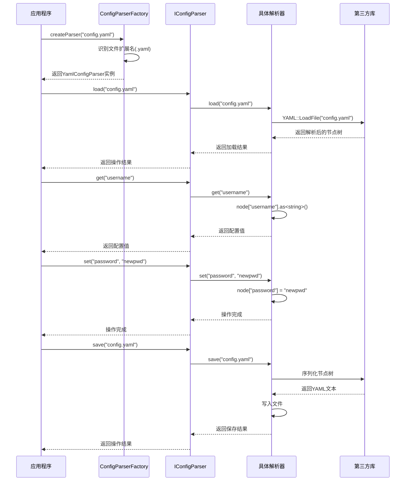
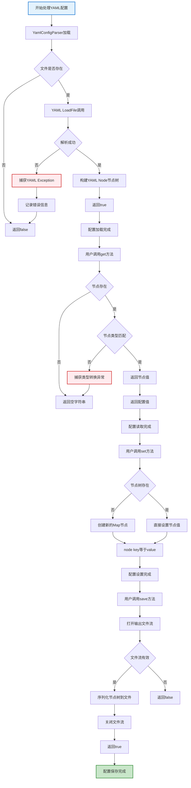

# 配置文件解析域技术实现文档

## 1. 概述

配置文件解析域是MultiFormatConfigParser项目的核心业务域，负责管理各种格式配置文件的完整生命周期，包括加载、解析、修改和保存操作。该领域提供了统一的配置管理能力，屏蔽不同格式间的技术差异，为上层应用提供标准化的配置访问接口。

## 2. 架构设计

### 2.1 整体架构

配置文件解析域采用分层架构设计，结合适配器模式和工厂模式，实现了松耦合、高内聚的架构设计：

```
应用层
  ↓
统一接口层 (IConfigParser)
  ↓
具体解析器层 (各格式专用解析器)
  ↓
第三方库层 (yaml-cpp, tinyxml2, toml++, inih, nlohmann_json)
```

### 2.2 核心组件

#### 2.2.1 统一接口 IConfigParser

```cpp
class IConfigParser {
public:
    virtual ~IConfigParser() {}
    virtual bool load(const std::string& filename) = 0;
    virtual std::string get(const std::string& key) const = 0;
    virtual void set(const std::string& key, const std::string& value) = 0;
    virtual bool save(const std::string& filename) const = 0;
};
```

该接口定义了所有配置解析器必须实现的四个核心操作：
- `load`: 从指定文件路径加载配置文件
- `get`: 根据键名获取配置值
- `set`: 设置指定键的配置值
- `save`: 将当前配置状态保存到文件

#### 2.2.2 工厂模式 ConfigParserFactory

```cpp
inline std::unique_ptr<IConfigParser> createParser(const std::string& filename) {
    auto ext_pos = filename.find_last_of('.');
    if (ext_pos == std::string::npos) return nullptr;
    std::string ext = filename.substr(ext_pos + 1);
    std::transform(ext.begin(), ext.end(), ext.begin(), ::tolower);
    if (ext == "json") return std::make_unique<JsonConfigParser>();
    if (ext == "yaml" || ext == "yml") return std::make_unique<YamlConfigParser>();
    if (ext == "xml") return std::make_unique<XmlConfigParser>();
    if (ext == "toml") return std::make_unique<TomlConfigParser>();
    if (ext == "ini") return std::make_unique<IniConfigParser>();
    return nullptr;
}
```

工厂类根据文件扩展名自动创建对应格式的解析器实例，实现了格式的自动识别和解析器的动态创建。

## 3. 各格式解析器实现

### 3.1 YAML配置解析器 (YamlConfigParser)

#### 3.1.1 技术实现

YAML配置解析器基于yaml-cpp库实现，使用YAML::Node作为内部数据结构：

```cpp
class YamlConfigParser : public IConfigParser {
    YAML::Node node;
public:
    bool load(const std::string& filename) override;
    std::string get(const std::string& key) const override;
    void set(const std::string& key, const std::string& value) override;
    bool save(const std::string& filename) const override;
};
```

#### 3.1.2 核心功能实现

**加载功能**：
```cpp
bool YamlConfigParser::load(const std::string& filename) {
    try {
        node = YAML::LoadFile(filename);
        return node ? true : false;
    } catch (const YAML::Exception& e) {
        return false;
    }
}
```

- 使用`YAML::LoadFile`直接加载文件
- 异常处理确保解析错误时程序稳定性
- 节点有效性检查确保加载成功

**获取配置值**：
```cpp
std::string YamlConfigParser::get(const std::string& key) const {
    if (node && node[key]) {
        try {
            return node[key].as<std::string>();
        } catch (const YAML::Exception& e) {
            return "";
        }
    }
    return "";
}
```

- 节点存在性检查避免访问无效节点
- 类型转换异常处理确保类型安全
- 空字符串作为默认值保护

**设置配置值**：
```cpp
void YamlConfigParser::set(const std::string& key, const std::string& value) {
    if (!node) {
        node = YAML::Node(YAML::NodeType::Map);
    }
    node[key] = value;
}
```

- 自动初始化Map类型节点
- 直接赋值操作设置配置项

**保存功能**：
```cpp
bool YamlConfigParser::save(const std::string& filename) const {
    std::ofstream out(filename);
    if (!out) return false;
    if (node) {
        out << node;
    } else {
        out << YAML::Node(YAML::NodeType::Map);
    }
    return true;
}
```

- 文件流有效性检查
- 节点序列化输出
- 空节点处理确保文件格式正确

### 3.2 XML配置解析器 (XmlConfigParser)

#### 3.2.1 技术实现

XML配置解析器基于tinyxml2库实现，使用XMLDocument和XMLElement管理XML结构：

```cpp
class XmlConfigParser : public IConfigParser {
    tinyxml2::XMLDocument doc;
    tinyxml2::XMLElement* root = nullptr;
public:
    bool load(const std::string& filename) override;
    std::string get(const std::string& key) const override;
    void set(const std::string& key, const std::string& value) override;
    bool save(const std::string& filename) const override;
};
```

#### 3.2.2 核心功能实现

**加载功能**：
```cpp
bool XmlConfigParser::load(const std::string& filename) {
    doc.Clear();
    root = nullptr;
    if (doc.LoadFile(filename.c_str()) != tinyxml2::XML_SUCCESS)
        return false;
    root = doc.FirstChildElement("root");
    return root != nullptr;
}
```

- 清理之前的文档状态
- 加载文件并检查加载结果
- 定位根元素并验证存在性

**获取配置值**：
```cpp
std::string XmlConfigParser::get(const std::string& key) const {
    if (!root) return "";
    for (tinyxml2::XMLElement* child = root->FirstChildElement("item"); child; 
         child = child->NextSiblingElement("item")) {
        const char* k = child->Attribute("key");
        if (k && key == k) {
            return child->GetText() ? child->GetText() : "";
        }
    }
    return "";
}
```

- 采用`<item key="value">`格式存储配置项
- 遍历所有item元素查找匹配的key
- 属性和文本内容存在性检查

**设置配置值**：
```cpp
void XmlConfigParser::set(const std::string& key, const std::string& value) {
    if (!root) {
        tinyxml2::XMLDeclaration* decl = doc.NewDeclaration();
        doc.InsertFirstChild(decl);
        root = doc.NewElement("root");
        doc.InsertEndChild(root);
    }
    for (tinyxml2::XMLElement* child = root->FirstChildElement("item"); child; 
         child = child->NextSiblingElement("item")) {
        const char* k = child->Attribute("key");
        if (k && key == k) {
            child->SetText(value.c_str());
            return;
        }
    }
    tinyxml2::XMLElement* item = doc.NewElement("item");
    item->SetAttribute("key", key.c_str());
    item->SetText(value.c_str());
    root->InsertEndChild(item);
}
```

- 自动创建XML声明和根元素
- 更新已存在的配置项
- 创建新配置项并添加到根元素

**保存功能**：
```cpp
bool XmlConfigParser::save(const std::string& filename) const {
    return doc.SaveFile(filename.c_str()) == tinyxml2::XML_SUCCESS;
}
```

- 直接调用tinyxml2的保存功能
- 返回保存操作状态

### 3.3 TOML配置解析器 (TomlConfigParser)

#### 3.3.1 技术实现

TOML配置解析器基于toml++库实现，使用toml::table作为内部数据存储：

```cpp
class TomlConfigParser : public IConfigParser {
    toml::table tbl;
public:
    bool load(const std::string& filename) override;
    std::string get(const std::string& key) const override;
    void set(const std::string& key, const std::string& value) override;
    bool save(const std::string& filename) const override;
};
```

#### 3.3.2 核心功能实现

**加载功能**：
```cpp
bool TomlConfigParser::load(const std::string& filename) {
    try {
        auto parse_result = toml::parse_file(filename);
        if (!parse_result) {
            return false;
        }
        tbl = std::move(parse_result.table());
        return true;
    } catch (const toml::parse_error& err) {
        return false;
    } catch (const std::exception& ex) {
        return false;
    }
}
```

- 使用toml::parse_file解析文件
- 移动语义优化性能
- 全面的异常处理机制

**获取配置值**：
```cpp
std::string TomlConfigParser::get(const std::string& key) const {
    if (auto node_view = tbl.get(key)) {
        if (node_view->is_string()) {
            return node_view->as_string()->get();
        }
    }
    return "";
}
```

- 使用tbl.get()进行安全访问
- 类型检查确保只返回字符串值
- 严格的类型安全处理

**设置配置值**：
```cpp
void TomlConfigParser::set(const std::string& key, const std::string& value) {
    tbl.insert_or_assign(key, value);
}
```

- 使用insert_or_assign方法更新或插入值
- 简洁高效的配置项设置

**保存功能**：
```cpp
bool TomlConfigParser::save(const std::string& filename) const {
    std::ofstream out(filename);
    if (!out) return false;
    out << tbl;
    return true;
}
```

- 文件流有效性检查
- 直接序列化表格数据到文件

### 3.4 INI配置解析器 (IniConfigParser)

#### 3.4.1 技术实现

INI配置解析器基于inih库实现，使用std::map存储键值对：

```cpp
class IniConfigParser : public IConfigParser {
    std::map<std::string, std::string> data;
    std::string lastFile;
public:
    bool load(const std::string& filename) override;
    std::string get(const std::string& key) const override;
    void set(const std::string& key, const std::string& value) override;
    bool save(const std::string& filename) const override;
};
```

#### 3.4.2 核心功能实现

**加载功能**：
```cpp
bool IniConfigParser::load(const std::string& filename) {
    data.clear();
    lastFile = filename;
    INIReader reader(filename);
    if (reader.ParseError()) return false;
    for (auto& section : reader.Sections()) {
        for (auto& key : reader.Keys(section)) {
            data[key] = reader.Get(section, key, "");
        }
    }
    return true;
}
```

- 清理之前的数据状态
- 使用INIReader解析文件
- 将section.key结构扁平化为单一键名
- 批量处理所有配置项

**获取配置值**：
```cpp
std::string IniConfigParser::get(const std::string& key) const {
    auto it = data.find(key);
    return it != data.end() ? it->second : "";
}
```

- 直接使用map查找机制
- 高效的键值检索
- 空字符串作为默认值

**设置配置值**：
```cpp
void IniConfigParser::set(const std::string& key, const std::string& value) {
    data[key] = value;
}
```

- 直接map赋值操作
- 简化的配置项设置逻辑

**保存功能**：
```cpp
bool IniConfigParser::save(const std::string& filename) const {
    std::ofstream out(filename);
    if (!out) return false;
    for (const auto& kv : data) {
        out << kv.first << "=" << kv.second << "\n";
    }
    return true;
}
```

- 简单的键值对格式输出
- 批量写入所有配置项

## 4. 业务流程

### 4.1 多格式配置统一访问流程



### 4.2 YAML配置文件处理详细流程



## 5. 技术特点与设计优势

### 5.1 技术特点

1. **统一接口设计**：所有解析器实现相同的IConfigParser接口，确保使用方式的一致性。

2. **异常处理机制**：各解析器都实现了完整的异常处理，确保在文件不存在、格式错误等情况下的程序稳定性。

3. **类型安全处理**：严格的类型检查和转换，确保配置值的正确获取和设置。

4. **内存管理优化**：使用现代C++特性（如智能指针）优化内存管理，避免内存泄漏。

5. **错误恢复能力**：在解析失败或配置项不存在时提供合理的默认值或错误状态。

### 5.2 设计优势

1. **松耦合架构**：各解析器实现相互独立，通过统一接口与上层交互，降低了模块间的耦合度。

2. **高扩展性**：基于工厂模式的设计使得新增配置格式支持变得简单，只需实现IConfigParser接口并注册到工厂中。

3. **可维护性**：清晰的职责分离和模块化设计，使得代码易于理解和维护。

4. **格式透明性**：上层应用无需关心具体配置格式，通过统一接口即可处理所有支持的格式。

5. **性能优化**：针对不同格式的特点采用最优的实现策略，如TOML解析器使用移动语义优化性能。

## 6. 外部依赖集成

配置文件解析域依赖以下第三方库实现各格式的解析功能：

| 外部系统 | 功能描述 | 交互类型 | 重要性 |
|---------|---------|---------|--------|
| nlohmann_json | 现代化JSON处理库，提供高性能的JSON解析和生成 | 依赖调用 | 高 |
| yaml-cpp | 完整的YAML 1.2规范实现，支持复杂YAML特性 | 依赖调用 | 高 |
| tinyxml2 | 轻量级XML解析器，简单易用，性能优秀 | 依赖调用 | 中 |
| toml++ | 现代C++ TOML解析库，支持最新TOML规范 | 依赖调用 | 中 |
| inih | 简单的INI文件解析库，轻量级且高效 | 依赖调用 | 低 |

## 7. 异常处理与错误管理

配置文件解析域实现了统一的异常处理机制，主要包含以下方面：

1. **文件操作异常**：处理文件不存在、权限不足、读写错误等情况。

2. **格式解析异常**：捕获各格式解析库抛出的解析异常，如YAML::Exception、toml::parse_error等。

3. **类型转换异常**：处理配置值类型不匹配导致的转换异常。

4. **内存异常**：处理内存分配失败等异常情况。

5. **错误状态反馈**：通过返回值（true/false）和空字符串等方式向上层传递错误状态。

## 8. 性能考虑

配置文件解析域在设计中考虑了以下性能因素：

1. **延迟加载**：配置文件只在需要时加载，避免不必要的I/O操作。

2. **内存效率**：各解析器采用适合其格式的内存数据结构，如YAML使用Node树，TOML使用table等。

3. **移动语义**：在TOML解析器中使用移动语义避免数据拷贝，提高性能。

4. **批量操作**：INI解析器支持批量配置项处理，减少循环开销。

5. **缓存机制**：解析后的配置数据缓存在内存中，提高读取性能。

## 9. 未来扩展方向

配置文件解析域未来可考虑以下扩展方向：

1. **新增格式支持**：支持更多配置格式，如Properties、HCL、HOCON等。

2. **配置验证**：添加配置schema验证功能，确保配置的正确性和完整性。

3. **监听机制**：实现配置文件变更监听，支持热加载配置。

4. **加密支持**：添加敏感配置项的加密存储功能。

5. **线程安全**：增强多线程环境下的使用安全性。

6. **性能优化**：针对大配置文件进行性能优化，如增量加载、延迟解析等。

## 10. 总结

配置文件解析域作为MultiFormatConfigParser项目的核心业务域，通过统一接口、工厂模式和适配器模式的组合，实现了对多种配置格式的统一处理。各解析器基于成熟的第三方库实现，提供了稳定可靠的配置管理能力。该领域设计清晰、扩展性强，为上层应用提供了简单易用的配置管理接口，显著提升了开发效率和系统的可维护性。